# Week 1 정리

## ch 1 

1. 데이터와 정보의 차이는 무엇인가
    - `데이터`는 현실 에서 가져온 값 그대로를 의미하고 의사 결정에 유용하게 활용할 수 있도록 데이터를 처리한 것이  ```정보```이다
1. 정보처리 란 무엇인가
    - 데이터에서 정보를 추출하는 과정 또는 방법을 `정보처리`라고 한다.
1. Raw 데이터는 무엇을 의미하는가
    - 정보 처리를 하기 전 상태 그대로의 데이터를 Raw 데이터 라고 한다.
1. 정보시스템 과 데이터베이스 각각을 설명하여라
    - `정보시스템`이란 조직 운영에 필요한 데이터를 수집해 저장해두었다가 필요할 때 유용한 정보를 만들어 주는 수단이다.
    - `데이터베이스`란 정보시스템 내부에서 데이터를 저장하고 있다가 필요할때 데이터를 제공하는 역할을 한다.
1. DB를 정의와 관련된 4가지 데이터에 대해서 설명하시오
    - `특정 조직의 여러 사용자가 _공유하여 사용할 수 있도록 _통합해서 _저장한 _운영 데이터의 집합`
    - 공유데이터 : 특정 조직의 여러 사용자가 함께 소유하고 이용할 수 있는 공용데이터
    - 통합데이터 : 최소의 중복과 통제 가능한 중복만 허용하는 데이터
    - 저장데이터 : 컴퓨터가 접근할 수 있는 매체에 저장된 데이터
    - 운영데이터 : 조직의 중 기능을 수행하기 위해 지속적으로 꼭 필요한 데이터
1. DB의 4가지 특성을 설명하시오
    - 실시간 접근 : 사용자의 데이터 요구에 실시간으로 응답
    - 계속 변화 : 데이터의 지속적인 삽입,삭제,수정을 통해 정확한 데이터 유지
    - 동시 공유 : 다른 데이터의 동시 사용뿐만 아니라 같은 데이터의 동시 사용도 지원
    - 내용 기반 참조 : 데이터의 저장된 주소나 위치가 아닌 내용 기반으로 참조


## ch 2 데이터베이스 관리 시스템
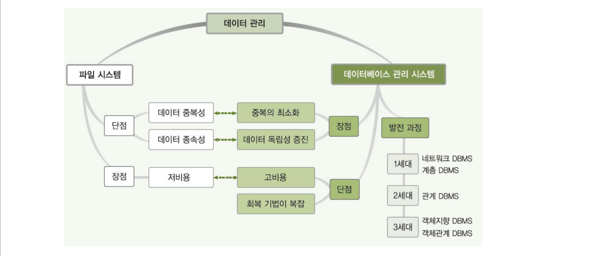
1. 파일시스템이란 무엇인가
    - 데이터를 파일로 관리하기 위해 수정 삽입 삭제등을 제공하는 소프트웨어
1. 파일시스템의 문제점 2가지를 설명하시오
    - 여러 파일이 중복 저장된다. `데이터 중복성`
        - 같은 내용의 데이터가 여러 파일에 중복 저장이 된다 -> 데이터 중복성
        - 이는 저장 공간의 낭비 , 데이터 일관성과 무결성을 유지하기 어렵다.
    - 응용 프로그램이 데이터 파일에 종속적이다. `데이터 종속성`
        - 사용하는 파일의 구조를 변경하면 응용프로그램 또한 변경되어야 한다.
1. 데이터의 일관성과 무결성은 무엇인가
    - 무결성 : 정확성과 일관성을 유지하고 보증하는 것
    - 일관성 : 각 사용자가 일관된 데이터를 보는 것
1. DBMS란?
    - 데이터베이스 관리 시스템 
    - 파일시스템의 문제를 해결하기 위해서 제시된 소프트웨어
    - 조직에 필요한 모든 데이터를 DB에 통합하여 저장하고 관리함 
    - 사용자의 데이터 -> 응용프로그램 -> DBMS -> DB 로 흘러간다.
1. DBMS의 주요기능 3가지
    - 정의 : 데이터베이스의 구조를 정의하거나 수정할 수 있다,
    - 조작 : 데이터를 삽입 삭제 수정 검색하는 연산을 할 수 있다.
    - 제어 : 데이를 항상 정확하고 안전하게 유지할 수 있다.

1. 1 ~ 3 세대 대표적인 DBMS와 특징은 무엇인가
    - 1세대 : 네트워크 DBMS => 그래프  , 계층 DBMS => 트리
    - 2세대 : 관계 DBMS
    - 3세대 : 객체지향 DBMS , 객체관계 DBMS

DBMS의 장단점

|장점|단점|
|:---|:---|
|데이터 중복을 통제|비용이 많이든다|
|데이터 독립성이 확보|백업과 회복 방법이 복잡|
|데이터를 동시 공유|중앙 집중 관리로 힘들다.|
|데이터 보안이 향상된다||
|데이터 무결성을 유지할 수 있다.||
|표준화할 수 있다.||
|장애 발생 시 회복이 가능하다||
|응용 프로그램 개발 비용이 줄어든다||

## ch 3 데이터베이스 시스템
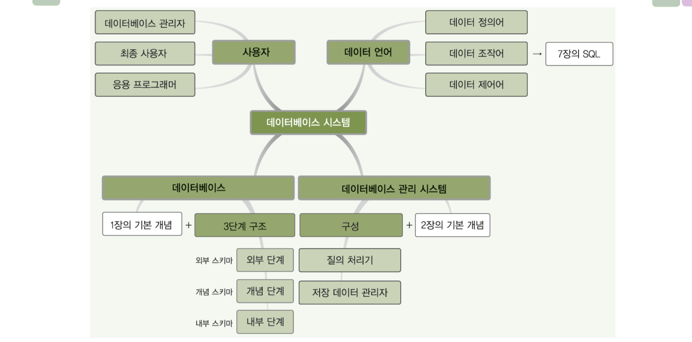
1. 데이터베이스 시스템이란 무엇인가 ( DBS )
    - 데이터베이스에 데이터를 저장하고 , 이를 관리하여 조직에 필요한 정보를 제공하는 시스템
1. 스키마와 인스턴스란 무엇인가
    - 스키마 : 데이터베이스에 저장되는 `데이터구조`와 `제약조건`을 정의한것
    - 인스턴스 : `스키마`에 따라 데이터 베이스에 실제 저장한 값
1. 3단계 데이터 베이스 구조를 설명하고 그들의 특징과 추상화 레벨에 대해서 설명하여라
    - `외부 단계` : `개별 사용자` 관점에서 이해하고 표현하는 단계 , 외부 `스키마는 여러개`가 존재할 수 있다. `서브스키마`라고도 한다.
    - `개념 단계` : `조직 전체`의 관점에서 이해하고 표현하는 단계 , 개념 `스키마는 1개`만 존재한다.
    - `내부 단계` : `저장 장치` 관점 , 실제로 저장되는 방법을 저의, `하드웨어 관점`, 내부 `스키마는 1개`만 존재한다.
    - 외부단계의 `추상화 레벨`이 가장 높다. ( 점점 더 함축적이라고 이해하면 될듯 )
    - 데이터 베이스 구조
    - 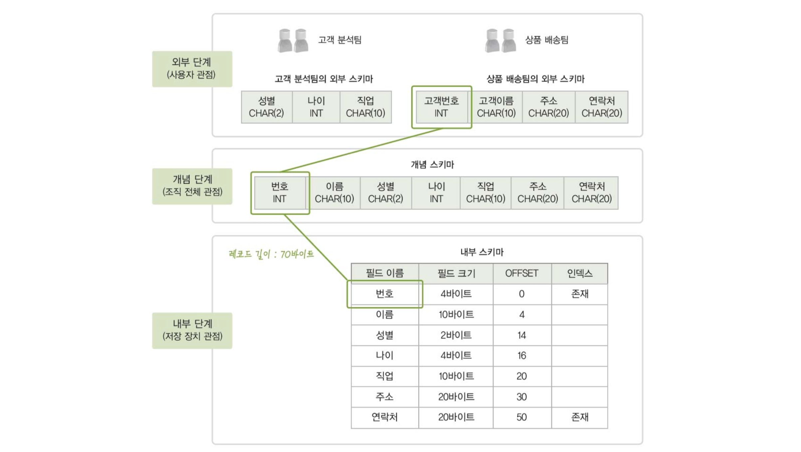

1. 데이터베이스 구조의 `사상`(`매핑`) 이란 무엇인가
    - 스키마 사이에 대응관계
    - `외부/개념 사상` (`응용 인터페이스`) : 외부 스키마와 개념 스키마의 대응관계
    - `개념/내부 사상` (`저장 인터페이스`) : 개념 스키마와 내부 스키마의 대응관계
1. 데이터베이스 구조의 사상은 왜 만들어졌는가
    - `데이터 독립성`을 위해서 만들어짐
1. 데이터 독립성의 정의와 2가지 데이터 독립성에 대해서 설명하여라
    - `데이터 독립성` : 하위 스키마가 변경 되더라도 상위 스키마는 영향을 받지 않는 특성
        - `논리적 독립성` : 개념 스키마가 변경이 되더라도 외부 스키마는 영향을 받지 않는다
            - `응용 인터페이스만 수정`해주면 된다.
        - `물리적 독립성` : 내부 스키마가 변경이 되더라도 개념 스키마는 영향을 받지 않는다.
            - `저장 인터페이스만 수정`해주면 된다.
1. `데이터사전`(`시스템카탈로그`) 란 무엇인가
    - `메타데이터`를 유지하는 시스템 데이터 베이스
    - 메타데이터란 데이터베이스에 저장되는 데이터에 관한 정보를 말한다. 
    - DBMS가 스스로 생성하고 유지한다.
    - 일반 사용자의 제한적인 수준의 접근이 가능하다
1. `데이터 디렉토리`란 무엇인가
    - 데이터 사전에 있는 데이터에 `실제로 접근하는데 필요한 위치 정보`를 가지고 있는 시스템 데이터 베이스
    - 일반 사용자의 접근은 허용되지 않는다.
1. `사용자 데이터 베이스`란 무엇인가
    - 사용자가 실제로 이용하는 데이터가 저장되어 있는 일반 데이터 베이스
1. 데이터베이스 `사용자`를 `3가지` 분류로 구분하고 설명하여라
    - `데이터베이스 관리자(DBA)`
        - 데이터베이스 시스템을 운영하고 관리하는사람
        - 주로 `데이터 정의어`(DDL)과 `데이터 제어어`(DCL)을 사용한다.
    - `최종 사용자(end user)`
        - DB에 접근하여 데이터를 조작(삽입 삭제 수정 검색)하는 사람
            - 이때 데이터 검색을 쿼리로 한다.
        - 주로 `데이터 조작어`(DML) 사용 
    - `응용 프로그래머(application programmer)`
        - 데이터 언어를 삽입하여 `응용프로그램을 작성`하는 사람
        - `데이터 조작어`(DML) 사용
1. 데이터 언어의 정의와 분류 3가지를 설명하여라
    - 데이터 언어란 `사용자와 데이터베이스 관리 시스템간의 통신수단`이다.
    - 사용 목적에 따라서 아래 3가지 분류로 나뉜다.
    - `데이터 정의어` (DDL)
        - 스키마를 정의하거나 수정 또는 삭제하기 위해서 사용된다.
    - `데이터 조작어` (DML)
        - 데이터의 추가 수정 삽입 삭제 등을 위해서 사용되는 언어
        - 절차적 데이터 언어와 비 절차적 데이터 언어로 나뉜다.
            - `절차적 데이터 언어`는 구체적으로 어떻게 해야할지 까지 알려준다 (how)
            - `비 절차적 언어`는 구체적은 사항은 얘기해주지 않는다. (how x)
    - `데이터 제어어` (DCL)
        - 내부적으로 필요한 규칙이나 기법을 정의하기 위해 사용 
1. 데이터베이스 관리 시스템
    - 데이터베이스 관리와 사용자의 데이터 처리 요구 수행
    - 주요 구성
        1. 질의 처리기
            - 데이터 처리 요구 해석
        1. 저장 데이터 관리자
            - 디스크에 저장된 사용자 데이터베이스와 데이터 사전을 관리

1. DMBS의 구성을 그려보시오
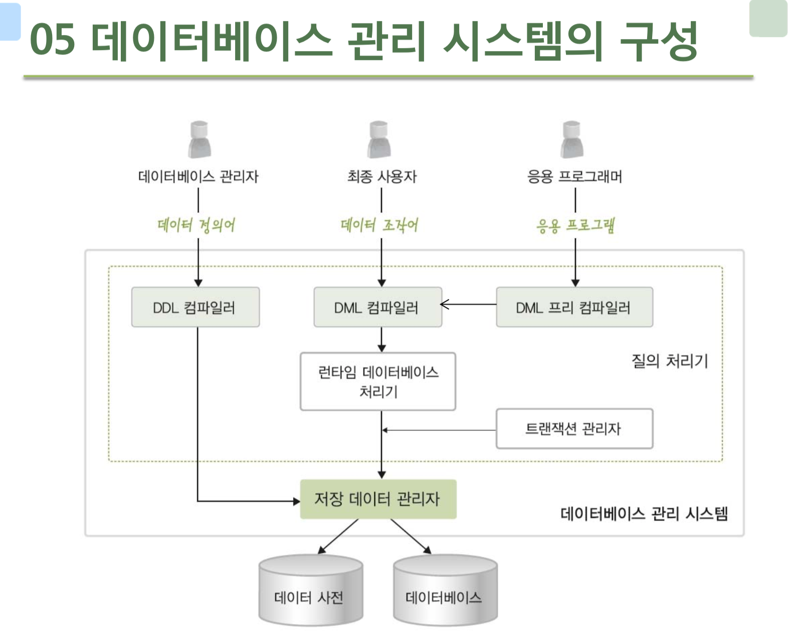

*** 

## 참고

- 데이터베이스 관리 시스템


# Week 2 정리

# ch 4 데이터 모델링

## ch 4-1 데이터 모델링의 개념

1. `데이터 모델링`이란 무엇인가
    - 현실세계에 존재하는 `데이터`를 컴퓨터에 `데이터 베이스`로 옮기는 `과정`
1. `추상화`란 무엇이고 언제 발생하는가
    - 데이터 모델링을 할 때 발생하고 `abstraction` 이라 불리며 `손실압축`이라고 불린다.
1. 2단계 데이터 모델링을 설명하여라
    - `개념적 데이터 모델링` : `현실세계 -> 개념세계` 로 중요 데이터를 추출하여 옮기는 과정을 말하며 , 특징화를 한다.
    - `논리적 데이터 모델링` : `개념세계 -> 데이터베이스` 로 데이터를 저장하는 구조를 표현하는 작업
1. `데이터 모델`을 설명하고 결과물로 나오는 모델을 2단계 모델과 더불어 설명하여라
    - 데이터 모델 : `데이터 모델링의 결과물`을 표현하는 도구
    - `개념적 데이터 모델` : 사람의 머리로 이해할 수 있도록 개념적인 형태로 모델링 하여, `데이터 베이스의 개념적 구조`로 표현하는 도구
    - `논리적 데이터 모델` : 개념적 구조를 논리적 형태로 모델링하여, `데이터 베이스의 논리적 구조`로 표현하는 도구
    - DB의 개념적 구조로 표현하는 도구는 개념적 데이터 모델이고 , 논리적 구조로 표현하는 도구는 논리적 데이터 모델이다.

***

## ch 4-2 개체 - 관계 모델
1. 개체 - 관계 모델과 다이어그램을 설명하여라
    - `개체 - 관계 모델`은 개체와 개체간의 관계를 이용해 현실 세계를 개념적 구조로 표현한 것
    - 핵심요소는 `개체 관계 속성` 이렇게 3가지이다.
    - 이를 그림으로 나타낸 것이 `개체-관계 다이어그램`이다.
        - `E-R model -> 그림 -> E-R diagram`
1. 개체란 무엇이고 다이어그램에서 어떻게 표현되는가?
    - 개체란 `구별되어 표현할 수 있는 모든 것`을 개체라고 부른다. (`Entity`)
    - 다른 개체와 `구별되는 이름`을 가지고 있고 각자 `고유한 특성이나 상태` , 즉 `속성`을 하나 이상 가지고 있다.
    - 파일 구조의 `레코드`와 대응됨
    - 개체는 다이어그램에서 `사각형`으로 표시된다.
1. 속성이란 무엇이고 다이어그램에서 어떻게 표현되는가?
    - `개체나 관계`가 가지고 있는 고유한 특성 (`Attribute`)
    - 파일 구조의 `필드`와 대응됨
    - 다이어그램에서 `타원`으로 표현이 된다.
1. 개체 타입 , 개체 인스턴스 , 개체 집합을 설명하여라
    - `개체 타입` : 개체를 고유의 이름과 속성들로 정의한것
        - 파일 구조의 `레코드 타입`과 대응됨
    - `개체 인스턴스` : 개체를 구성하고 있는 속성이 실제 값을 가짐으로서 `실체화`된 개체 
        - 파일 구조의 `레코드 인스턴스`에 대응됨
    - `개체 집합` : 특정 개체 타입에 대한 개체 인스턴스를 모아놓은 것
1. 아래 그림에 빈칸에 들어갈 말은?

    - 개체 이름 , 속성 
    - 개체 타입 , 개체 인스턴스 , 개체 집합 

*** 
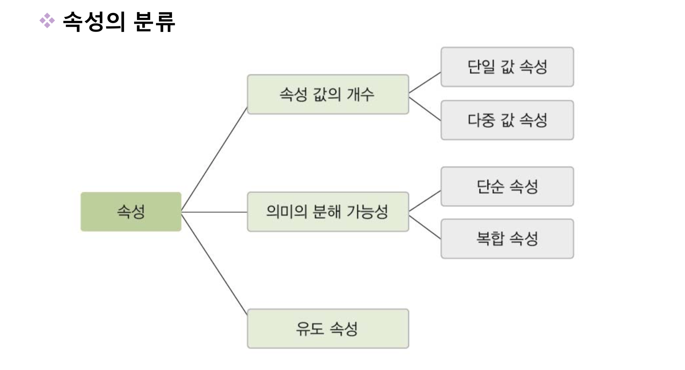
- `아래 문제들은 다이어그램에서 어떻게 표현되는지 또한 생각해야 한다.`
1. 개체의 속성 중 단일 값 속성과 다중 값 속성에 대해서 설명하여라
    - `단일 값 속성` : 값을 하나만 가질 수 있는 속성
        - `타원`으로 표시
    - `다중 값 속성` : 값을 여러개 가질 수 있는 속성
        - `이중 타원`으로 표시 
    - 
1. 개체의 속성 중 단순 속성과 복합 속성에 대해서 설명하여라
    - `단순 속성` : 더 이상 의미를 분해할 수 없는 속성
    - `복합 속성` : 의미를 분해해서 여러개로 나눌 수 있는 속성
        - ex) 생년월일 -> 년 월 일 ( 의미 세분화 가능 ) - `복합속성`이다.
    - 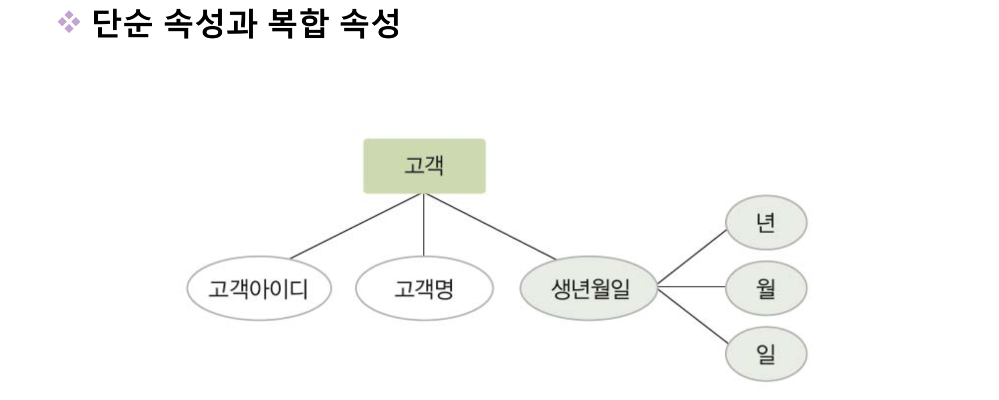
1. 개체의 유도 속성에 대해서 설명하여라
    - `유도 속성`이란 처음에는 값이 정해져 있지 않고 다른 값들에 의해 정해지는 속성
    - `점선 타원`으로 표시
    - 
1. 개체의 널 속성과 널 값에 대해서 설명하여라
    - 널 속성 : `널 값이 허용`되는 속성
    - 널 값 : 아직 정해지지 않은 값 혹은 모르는 값일때 NULL 을 사용
        - `공백이나 0 과는 의미가 다르다`
1. 개체의 키 속성에 대해서 설명하여라
    - 각 개체 인스턴스를 구분할 수 있는 유일한 속성
        - `밑줄`로 표시
    - 
1. 개체의 관계에 대해서 설명하고 동의어는 무엇인가
    - 개체와 개체가 맺고있는 의미 있는 연관성
    - 개체 집합들 사이의 대응관계 , `매핑(mapping)` 을 의미
        - `마름모`로 표현
    - 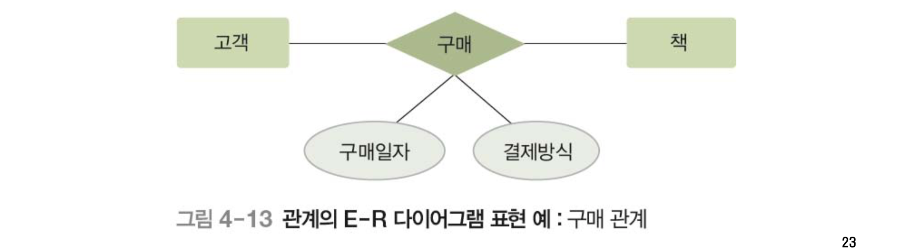
1. `관계의 유형` ( 관계 타입의 수 기준 , 매핑 카디널리티 기준 ) 각각 3가지를 설명하여라 
    - `관계 타입 수` 기준
        1. 이항 관계 : 두개의 개체가 맺고 있는 관계 
        1. 삼항 관계 : 세개의 개체가 맺고 있는 관계 
        1. 순환 관계 : 개체 타입 하나가 자기 자신과 맺고 있는 관계
    - `매핑 카티널리티` 기준
        1. `일대일` 관계 : 각 개체의 인스턴스가 상대 개체 인스턴스와 하나씩만 관계를 맺는다.
        1. `일대다` 관계 : 하나의 개체 인스턴스는 상대 개체 인스턴스와 여러개의 관계를 맺고 반대로는 하나의 관계만 맺을 수 있다. -> 하나만 여러개의 관계 나머지 하나는 하나의 관계
        1. `다대다` 관계 : 각자 개체 인스턴스는 여러개의 관계를 맺을 수 있다. 
1. `매핑 카디널리티`란 무엇인가
    - 개체 인스턴스가 다른 개체 인스턴스와 `관계를 맺는 수`
1. 관계의 참여 특성 2가지를 설명하여라 
    - `필수적` 참여 : 모든 개체 인스턴스가 관계에 반드시 참여해야 한다.
        - `이중선`으로 표시
    - `선택적` 참여 : 개체 인스턴스 중 일부만 관계에 참여해도 상관없음
    - 
1. `오너개체`와 `약한개체`를 설명하여라
    - `오너 개체` : 다른 개체의 존재 여부를 결정하는 개체
        - `약한 개체와 일대다 관계`를 가지고 , 약한 개체는 오너 개체와의 관계에 `필수적 참여`하는 특징이 있다.
    - `약한 개체` : 다른 개체의 존재 여부에 의존적인 개체
        - 약한 개체는 오너 개체의 키 값을 포함하여 키를 구성한다.
    - 약한 개체는 `이중 사각형` 약한 개체가 오너 개체와 맺는 관계는 `이중 마름모`로 표현
    - 
1. 개체 다이어그램을 그려보자 아래 특성에 맞는 도형을 생각하여라
    - 개체를 표현 : 사각형
    - 관계를 표현 : 마름모
    - 속성을 표현 : 타원
    - 각 요소를 연결 : 선 
    - 일대일 , 일대다 , 다대다 관계를 표기 : 레이블
    - 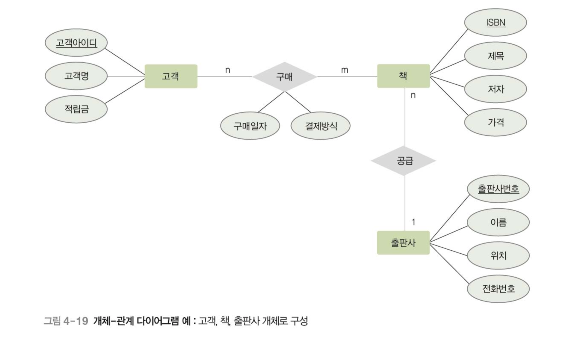

***

## ch 4-3 논리적 데이터 모델 

1. 논리적 데이터 모델의 개념과 특성에 대해서 설명하시오
    - E-R 다이어그램으로 표현된 개념적 구조를 데이터 베이스에 저장할 형태로 표현한 논리적 구조
    - `데이터베이스의 논리적 구조 = 데이터베이스 스키마`
1. 논리적 데이터 모델 3가지를 말하고 설명하시오
    - 관계 데이터 모델 : 논리적 구조가 2차원 테이블 형태
    - 계층 데이터 모델 : 논리적 구조가 트리 형태이다
        - 루트 역할을 하는 개체가 존재하고 , 사이클은 없다.
        - `두 개체 사이에 하나의 관계만 정의할 수 있다.`
        - 상하 관계를 가진다. ( 부모와 자식 , 일대다 관계)
        - 구조가 복잡하고 삽입 수정 검색 삭제가 쉽지 않다.
    - 네트워크 데이터 모델 : 논리적 구조가 그래프 형태이다.
        - `두 개체 사이에 여러 관계를 정의할 수 있다.`
        - 오너와 멤버 가 있으며 일대다 관계이다.
        - 구조가 복잡하고 삽입 수정 검색 삭제가 쉽지 않다.

***

# ch 5  관계 데이터 모델

## ch 5-1 관계 데이터 모델의 개념
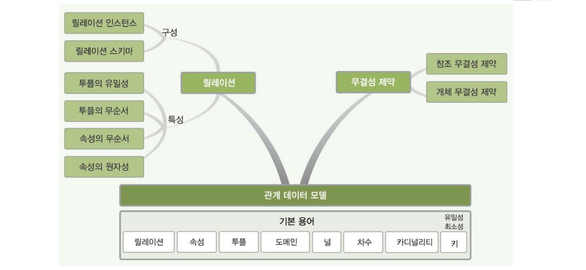
1. 릴레이션 , 속성 , 투플에 대해서 설명하시오
    - `릴레이션` : 하나의 개체에 대한 데이터를 하나의 2차원 에이블 구조로 정의한 것
        - 파일 관리 시스템에서 `파일`에 해당
    - `속성` : ( 열 , Attribute) 라고도 함 
        - 파일 관리 시스템에서 `필드`에 해당
    - `투플` : 릴레이션의 행
        - 파일 관리 시스템에서 `레코드`에 해당 
1. 도메인 , 널 , 차수 , 카디널리티에 대해서 설명하시오
    - `도메인` : 하나의 속성이 가질 수 있는 모든 값의 집합
        - 속성 값을 입력할 때 적합성 판단의 기준이 된다.
        - 속성의 특성을 고려한 데이터 타입으로 정의
    - 널 : 속성을 `아직 모르거나`, 다른 속성에 의해서 정해질 수 있어서 아직 정해지지 않은 값 
    - `차수` : 하나의 릴레이션에서 속성의 전체 개수 ( `가로` )
    - `카디널리티` : 하나의 릴레이션에서의 투플의 전체 개수 ( `세로` )
    - 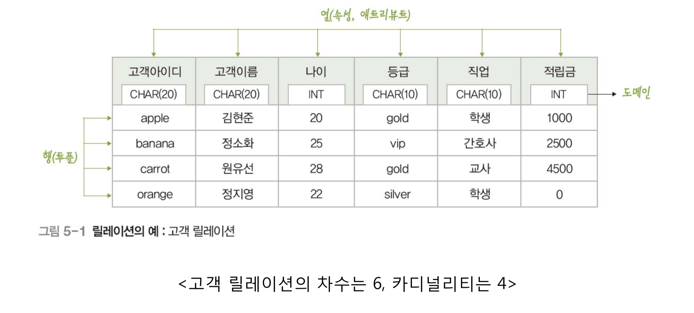
1. 릴레이션 스키마와 릴레이션 인스턴스를 설명하고, 스키마는 예제를 작성하시오
    - `릴레이션 스키마` : 릴레이션의 논리적 구조
        - `릴레이션 내포` 라고도 한다.
        - 릴레이션의 이름과 포함된 모든 속성 이름으로 정의
        - `정적`인 특성이 있음
        - ex) `고객(고객아이디, 고객이름, 나이, 등급)`
    - `릴레이션 인스턴스` : 어느 한 시점에 존재하는 투플들의 집합
        - `릴레이션 외연` 이라고도 한다.
        - `동적`인 특성이 있다.
1. 릴레이션의 구성과 데이터베이스의 구성에 대해서 설명하시오
    - `릴레이션 스키마`와 `릴레이션 인스턴스`
    - `데이터베이스 스키마`와 `데이터베이스 인스턴스`
    - 데이터베이스 스키마 : `릴레이션 스키마의 모음`
    - 데이터베이스 인스턴스 : `릴레이션 인스턴스의 모음`
    - 참고사진
    
1. 릴레이션의 특성에 대해서 설명하시오
    - `투플`의 `유일성` : 동일한 투플이 존재할 수 없다.
    - `투플`의 `무순서` : 하나의 릴레이션에서 투플들의 순서는 무의미하다.
    - `속성`의 `무순서` : 하나의 릴레이션에서 속성들의 순서는 무의미하다.
    - `속성`의 `원자성` : 속성 값으로 원자 값만 사용할 수 있다.
        - 원자성이란 더이상 분해될 수 없는 값으로 되어있다는 말이다 !
1. 키의 정의와 특성 5가지중 외래키를 제외한 4가지를 설명하시오
    - 키 : 릴레이션에서 투플들을 유일하게 구별하는 속성 또는 속성들의 집합
        - `유일성` 과 `최소성`을 만족해야 한다.
        - 유일성 : 모든 투플은 서로 다른 키 값을 가져야 한다
        - 최소성 : 꼭 필요한 최소한의 속성들로만 구성
    - `수퍼키` : `유일성`을 만족하는 속성 또는 속성들의 `집합` 
    - `후보키` : `유일성`을 만족하고 `최소성`을 만족하는 속성 또는 속성들의 `집합`
    - `기본키` : 유일성과 최소성을 만족하고 기본적으로 사용하기 위해 선택한 키
    - `대체키` : 유일성과 최소성을 만족하지만 선택되지 않은 키 
    - 참고사진
    
1. 외래키에 대해서 설명하고 특징들을 예시를 들어 나열하시오
    - `외래키` : 다른 릴레이션의 기본키를 참조하는 속성 또는 속성들의 집합
        - 릴레이션들 간의 관계를 표현
        - `참조하는 릴레이션` : 상대 릴레이션의 기본키를 자신의 외래키로 가진다. 
        - `참조되는 릴레이션` : 자신의 기본키가 다른 릴레이션에 의해서 참조되고 있다.
    - 외래키 속성과 그것이 참조하는 기본키의 `이름은 달라도 되지만 , 도메인은 같아야 한다.`
    - 하나의 릴레이션에 외래키가 여러개 존재할 수도 있고, `외래키를 기본키로 사용 할 수도 있다.`
    - 같은 릴레이션 기본키를 참조하는 외래키를 만들수도 있다. 그리고 `외래키는 널 값을 가질수도 있다.`

***

## ch 5-2 관계 데이터 모델의 제약

1. 무결성 제약조건에 대해서 설명하시오
    - 데이터의 무결성을 유지하고 일관된 상태로 유지하기 위한 조건
    - 데이터의 무결성 : 데이터를 `결함이 없는` 상태, `정확`하고 `유효`하게 유지하는것
1. 무결성 제약조건 2가지에 대해서 설명하시오
    - `개체` 무결성 제약조건 : `기본키`를 구성하는 모든 속성은 `널 값을 가질 수 없는` 규칙
    - `참조` 무결성 제약조건 : 외래키는 참조할 수 없는 값을 가질 수 없는 규칙
        - 외래키의 대상이 되는 `기본키의 값 중에 하나`로 외래키의 값이 들어와야 한다.
        - `단 외래키의 값이 NULL값이 될 수도 있다`. 이런 경우에는 참조 무결성 제약조건을 위반한 것이 아니다.

***

## 참고 

- 데이터 모델

- 속성의 특징

- 관계 데이터 모델
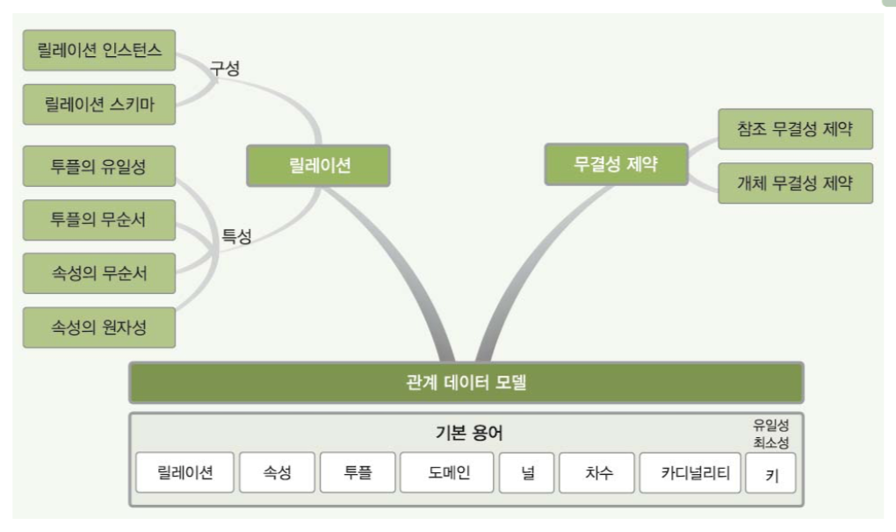
- 키의 특성과 종류
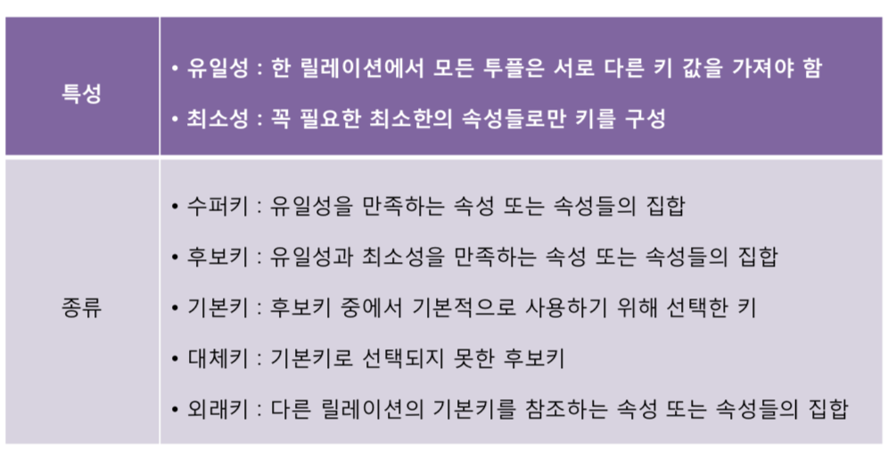

# ch 6 관계 데이터 연산
## 6-1 관계 데이터 연산의 개념
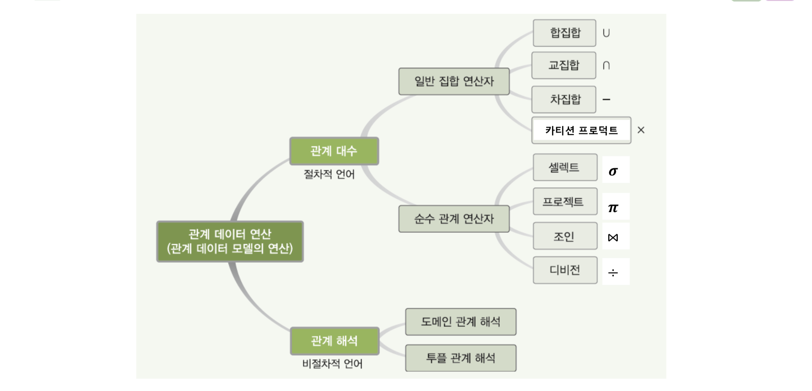
- 데이터 모델 = 데이터 구조 + 연산 + 제약조건
1. 관계 데이터 연산을 수행하는 두가지 기술을 설명하시오
    - `관계 대수` : 절차적 언어
        1. `일반 집합 연산자`
        1. `순수 관계 연산자`
    - `관계 해석` : 비 절차적 언어
        1. `도메인 관계 해석`
        1. `투플 관계 해석` 
    - 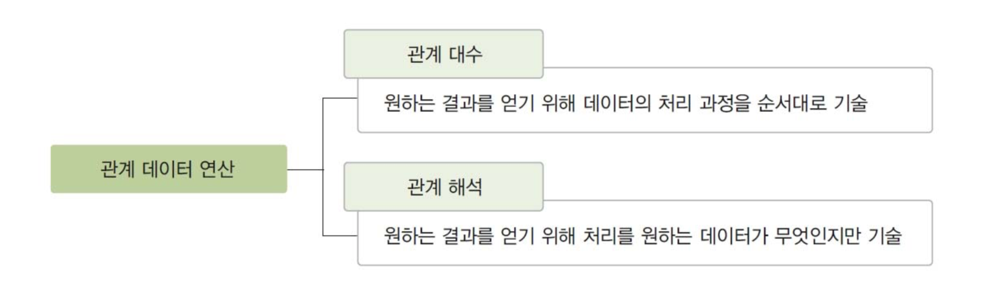
1. 관계적으로 완전하다는 말은 무슨 뜻인지 설명하시오
    - `관계 대수` 나 `관계 해석`으로 기술할 수 있는 모든 질의를 기술할 수 있는 데이터 언어를 말한다.

## ch 6-2 관계 대수 
##### 기호 모음 &cap; &cup; &#8904; &#8905; % &#8905;

1. 관계 대수의 2가지 분류에 대해서 말하시오
    - `관계 대수` : 원하는 결과를 얻기 위해 릴레이션의 `처리 과정을 순차적으로` 기술하는 언어
    - 릴레이션을 처리하는 연산자들의 모임
    - `일반 집합 연산자` : 릴레이션이 투플의 집합이라는 개념을 이용하는 연산자 
    - `순수 관계 연산자` : 릴레이션의 구조와 특성을 이용하는 연산자
1. 연산의 결과도 릴레이션이고 , 피 연산자도 릴레이션인 것을 무슨 특성이라 하는가
    - `폐쇄 특성`
1. R U S , R &cap; S , R - S , R X S 는 무슨 연산자의 기호인지 설명하고 각각에 대해서 설명하여라  
    1. R U S : `합집합`
        - R 에 속하거나 S 에 속하는 모든 투플들을 반환
        - 차수는 R , S 의 차수와 같음 
        - 카디널리티는 R , S 보다 같거나 크다
    1. R &cap; S : `교집합`
        - R 과 S 에 속하는 모든 투플들을 반환
        - 차수는 R , S 의 차수와 같음 
        - 카디널리티는 R , S 보다 클수 없음
    1. R - S : `차집합`
        - R 에 속하는 투플 중에서 S 에도 속하는 투플을 제외한 투플들을 반환
        - `유일하게 교환적 , 결합적 특징이 없음`
        - 차수는 R , S 의 차수와 같음 
        - 카디널리티는 R 보다 클수 없음 
    1. R X S : `카티션 프로덕트`
        - R 에 속하는 모든 투플들과 S에 속하는 모든 투플들을 연결해서 새로운 투플을 반환
        - 차수는 R의 차수과 S의 차수를 더한것과 같음
        - 카디널리티는 R의 투플 개수와 S의 투플 개수를 곱한것과 같다.
    1. 결국 차집합을 제외한 모든 일반 집합 연산자는 교환 결합 특징이 있다.
    1. 차수는 속성의 개수 , 카디널리티는 투플의 개수이다.
1. 교집합 , 합집합 , 차집합을 하기 위한 릴레이션의 조건을 설명하여라 
    - 두 릴레이션은 합병이 가능해야 한다.
    - 합병을 위한 조건은 1. 차수가 동일해야 하고 2. 속성의 도메인이 동일해야 한다.


1. 순수 관계 연산자 4가지를 설명하고 수학적 표현 , 데이터 언어적 표현 을 써라 
    - `조건식`은 `비교식` , `프레디킷` 이라고도 불린다.
    - `셀렉트` : 조건을 만족하는 투플만 선택해서 릴레이션을 구성
        - 하나의 릴레이션
        - σ(조건식)(릴레이션) || 릴레이션 where 조건식
    - `프로젝트` : 릴레이션에서 선택한 속성의 값으로 결과 릴레이션을 구성
        - 하나의 릴레이션
        - π(속성리스트)(릴레이션) || 릴레이션[속성리스트]
    - `조인` : `조인속성`을 이용해 두 릴레이션을 조합
        - `조인속성` : 두 릴레이션이 공통으로 가지고 있는 속성
        - `자연조인` 이라고도 한다.
        - 두개의 릴레이션 필요
        - R ⋈ S 
        - 조인속성이 같은것만 연결하고 , 없는 것은 무시한다.
    - `디비전` : 릴레이션 2의 모든 투플과 관련이 있는 릴레이션 1의 투플로 결과 릴레이션을 반환
        - 릴레이션 1 % 릴레이션 2
        - 릴레이션 1 이 릴레이션 2 의 `모든 속성을 포함`하고 있어야 한다.
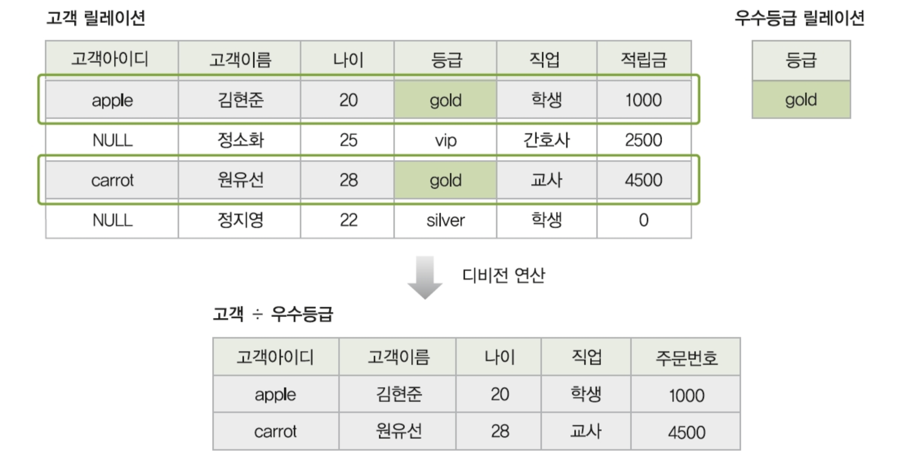
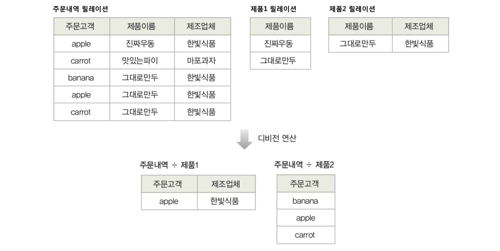

1. 조인의 세타조인 동일조인 외부조인 세미조인 에 대해서 설명하여라
    - `세타조인` : `자연조인`에 비해서 더 일반화된 조인으로서 자연조인은 2개의 조인속성을 하나로 합치는 반면 세타조인은 둘다 그대로 결과 릴레이션에 나타난다. 
        - 릴레이션 1 ⋈ A θ B 릴레이션 2
        - 이때 θ 는 비교 연산자 ( > < = ) 등을 의미한다.
        - ex) R ⋈ 고객등급 = 'gold' S
    - `동일조인` : 세타 조인 중에서 θ 가 = 인 경우
    - `세미조인` : 릴레이션 1 &#8905; 릴레이션 2 인경우 조인해서 릴레이션 1만 결과가 나온다.
    - `외부조인` : 릴레이션 1 ⋈+ 릴레이션 2 각 투플의 모든 결과를 반환하는데 만약에 값이 없는 경우는 NULL 로 대체된다.
    - 
    - 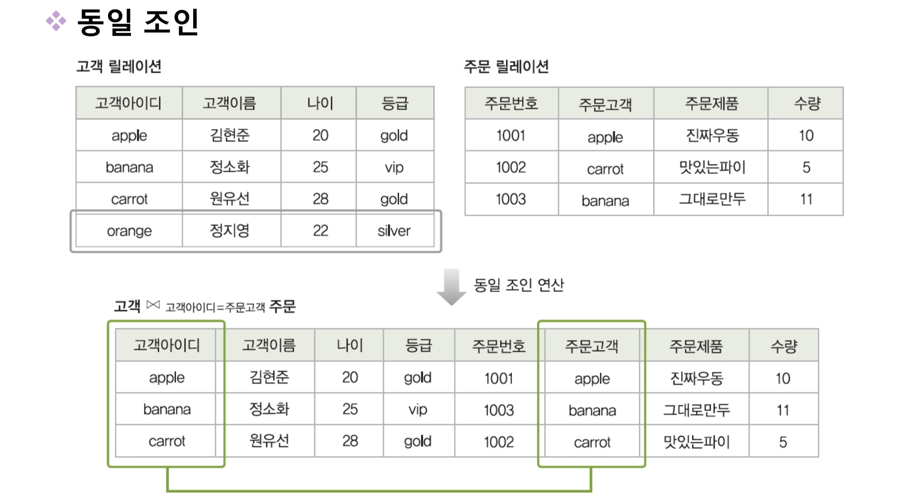
    - 
    - 


## ch 6-3 관계 해석
1. 관계해석의 뜻과 2가지 분류로 나누면 무엇이 되는가 
    - 처리를 원하는 데이터가 무엇인지만 기술하는 언어
    - `비절차 언어`
    1. `투플 관계 해석`
    1. `도메인 관계 해석`

# 7장 데이터 베이스 언어 빠르게 정리
# 항상 세미콜론 잊지말자


## SQL 
- 의미 2가지
    1. 관계 데이터베이스를 위한 `표준 질의어`
    1. `비절차적` 데이터 언어
- 사용 방식
    1. 대화식 SQL : 직접 데이터베이스 관리 시스템에 접근해 질의를 실행
    1. 삽입 SQL : 프로그래밍 언어로 작성된 응용 프로그램에 삽입
    
## SQL 분류 3가지
1. `DDL` : 데이터 정의어 
    - 테이블 자체에 관련되어있다.
    - 테이블을 생성하고 변경 제거 하는 기능을 제공한다. (= `스키마 컨트롤`)
2. `DML` : 데이터 조작어
    - 테이블 내에 데이터 관련
    - 테이블에 새 데이터를 삽입 , 저장된 데이터를 수정 삭제 검색 하는 기능을 제공
1. `DCL` : 데이터 제어어 
    - DBA 만 접근이 가능
    - 보안을 위해 데이터에 대한 접근 및 사용 권한을 사용자별로 부여하거나 취소

## DDL
1. CREATE TABLE
    - CEATE TABLE 테이블이름{}  
    - 5가지 속성이 있다. 
    1. 속성
        - NOT NULL 속성, DEFAULT 속성
    1. 기본키
        - PRIMARY KEY(고객아이디)
    1. 대체키
        - UNIQUE(고객이름)
    1. 외래키
        - FOREIN KEY(외래키) REFERENCES 테이블(테이블속성)
        - ON UPDATE/DELETE ( NO action, cascade, set null, set default )
    1. 무결성 제약 조건
        - CONSTRAIN은 고유한 이름을 부여하기 위한것이고 `CHECK`가 핵심이다.
        - CONSTRAIN CHK CHECK(조건);
        - CHECK(조건)
2. ALTER TABLE
    - `ALTER TABLE 테이블이름 []`
    1. 새로운 속성 추가
        - [] 자리에 `ADD 속성 속성_타입 [NOT NULL] [DEFAULT_기본값];`
    1. 기존 속성 삭제
        - [] 자리에 `DROP 속성_이름 [CASCADE || RESTRICT];`
        - CASCADE : 함께 삭제
        - RESTRICT : 삭제 거부
    1. 제약조건 추가
        - [] 자리에 `ADD CONTRAIN 제약조건_이름 제약조건_내용;`
        - ADD CONSTRAIN CHK CHECK(나이>=20);
    1. 제약조건 삭제 
        - [] 자리에 `DROP CONTRAIN 제약조건_이름;`
3. DROP TABLE
    - DROP TABLE 테이블_이름 [CASCADE || RESTRICT];
    - CASECADE : 참조하는 다른 테이블도 제거
    - RESTIRCT : 참조하는것이 존재하면 거부

## DML
1. SELECT
    - SELECT [ALL | DISTINCT] 속성리스트
    - FROM 테이블
    - GROUP BY [HAVING]
    - ORDER BY
    - WHERE 조건
    - order by 키워드는 asc,desc 이고, null은 가장 작은 값으로 취급 
    - where 의 키워드는 LIKE , IS NULL , 부속질의문 (IN , > , = , EXISTS)
    - 집계함수는 SELECT 절이나 HAVING 절에서만 사용 가능하다 ! null은 무시한다는것을 기억하자
1. INSERT
    - INSERT INTO 테이블이름(속성_리스트) VALUES (속성값_리스트);
    - INSERT INTO 테이블이름(속성_리스트) SELECT 문; 
    - 이렇게도 가능하다. 결과물이 삽입
1. UPDATE
    - UPDATE 테이블_이름 SET 속성이름=값 , ... [WHERE 조건];
    - 조건이 없는 경우 테이블의 모든 투플에 적용
1. DELETE
    - DELETE FROM 테이블 [WHERE 조건];
