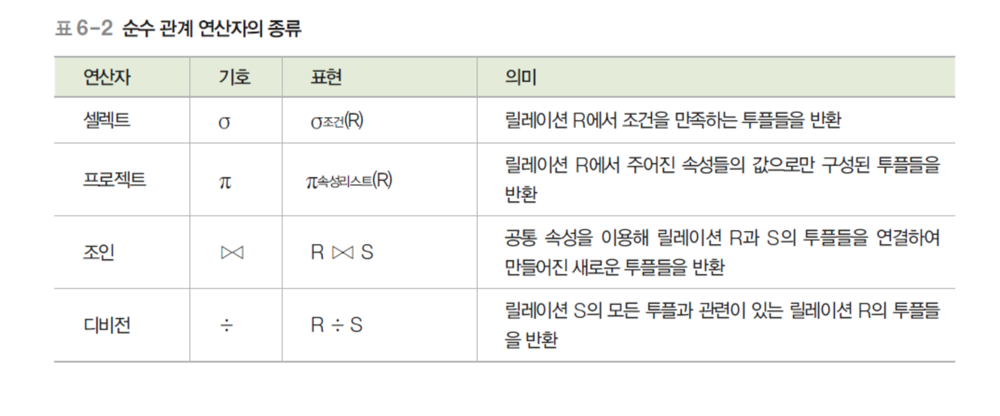
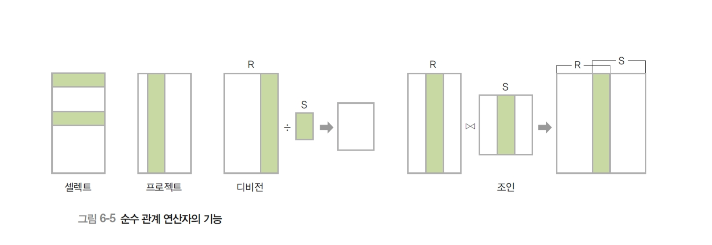
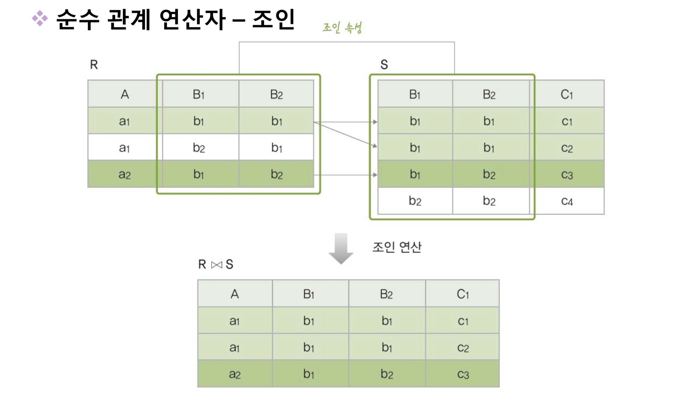
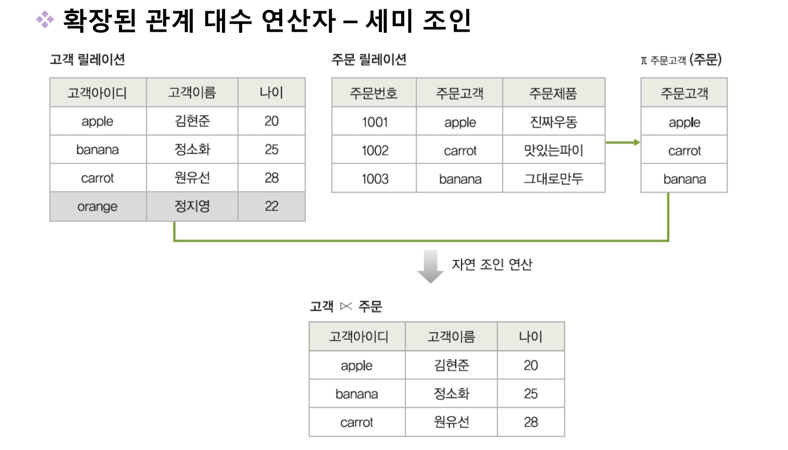

# ch 6 관계 데이터 연산
## 6-1 관계 데이터 연산의 개념

- 데이터 모델 = 데이터 구조 + 연산 + 제약조건
1. 관계 데이터 연산을 수행하는 두가지 기술을 설명하시오
    - `관계 대수` : 절차적 언어
        1. `일반 집합 연산자`
        1. `순수 관계 연산자`
    - `관계 해석` : 비 절차적 언어
        1. `도메인 관계 해석`
        1. `투플 관계 해석` 
    - 
1. 관계적으로 완전하다는 말은 무슨 뜻인지 설명하시오
    - `관계 대수` 나 `관계 해석`으로 기술할 수 있는 모든 질의를 기술할 수 있는 데이터 언어를 말한다.

## ch 6-2 관계 대수 
##### 기호 모음 &cap; &cup; &#8904; &#8905; % &#8905;

1. 관계 대수의 2가지 분류에 대해서 말하시오
    - `관계 대수` : 원하는 결과를 얻기 위해 릴레이션의 `처리 과정을 순차적으로` 기술하는 언어
    - 릴레이션을 처리하는 연산자들의 모임
    - `일반 집합 연산자` : 릴레이션이 투플의 집합이라는 개념을 이용하는 연산자 
    - `순수 관계 연산자` : 릴레이션의 구조와 특성을 이용하는 연산자
1. 연산의 결과도 릴레이션이고 , 피 연산자도 릴레이션인 것을 무슨 특성이라 하는가
    - `폐쇄 특성`
1. R U S , R &cap; S , R - S , R X S 는 무슨 연산자의 기호인지 설명하고 각각에 대해서 설명하여라  
    1. R U S : `합집합`
        - R 에 속하거나 S 에 속하는 모든 투플들을 반환
        - 차수는 R , S 의 차수와 같음 
        - 카디널리티는 R , S 보다 같거나 크다
    1. R &cap; S : `교집합`
        - R 과 S 에 속하는 모든 투플들을 반환
        - 차수는 R , S 의 차수와 같음 
        - 카디널리티는 R , S 보다 클수 없음
    1. R - S : `차집합`
        - R 에 속하는 투플 중에서 S 에도 속하는 투플을 제외한 투플들을 반환
        - `유일하게 교환적 , 결합적 특징이 없음`
        - 차수는 R , S 의 차수와 같음 
        - 카디널리티는 R 보다 클수 없음 
    1. R X S : `카티션 프로덕트`
        - R 에 속하는 모든 투플들과 S에 속하는 모든 투플들을 연결해서 새로운 투플을 반환
        - 차수는 R의 차수과 S의 차수를 더한것과 같음
        - 카디널리티는 R의 투플 개수와 S의 투플 개수를 곱한것과 같다.
    1. 결국 차집합을 제외한 모든 일반 집합 연산자는 교환 결합 특징이 있다.
    1. 차수는 속성의 개수 , 카디널리티는 투플의 개수이다.
1. 교집합 , 합집합 , 차집합을 하기 위한 릴레이션의 조건을 설명하여라 
    - 두 릴레이션은 합병이 가능해야 한다.
    - 합병을 위한 조건은 1. 차수가 동일해야 하고 2. 속성의 도메인이 동일해야 한다.

1. 순수 관계 연산자 4가지를 설명하고 수학적 표현 , 데이터 언어적 표현 을 써라 
    - `조건식`은 `비교식` , `프레디킷` 이라고도 불린다.
    - `셀렉트` : 조건을 만족하는 투플만 선택해서 릴레이션을 구성
        - 하나의 릴레이션
        - σ(조건식)(릴레이션) || 릴레이션 where 조건식
    - `프로젝트` : 릴레이션에서 선택한 속성의 값으로 결과 릴레이션을 구성
        - 하나의 릴레이션
        - π(속성리스트)(릴레이션) || 릴레이션[속성리스트]
    - `조인` : `조인속성`을 이용해 두 릴레이션을 조합
        - `조인속성` : 두 릴레이션이 공통으로 가지고 있는 속성
        - `자연조인` 이라고도 한다.
        - 두개의 릴레이션 필요
        - R ⋈ S 
        - 조인속성이 같은것만 연결하고 , 없는 것은 무시한다.
    - `디비전` : 릴레이션 2의 모든 투플과 관련이 있는 릴레이션 1의 투플로 결과 릴레이션을 반환
        - 릴레이션 1 % 릴레이션 2
        - 릴레이션 1 이 릴레이션 2 의 `모든 속성을 포함`하고 있어야 한다.

1. 조인의 세타조인 동일조인 외부조인 세미조인 에 대해서 설명하여라
    - `세타조인` : `자연조인`에 비해서 더 일반화된 조인으로서 자연조인은 2개의 조인속성을 하나로 합치는 반면 세타조인은 둘다 그대로 결과 릴레이션에 나타난다. 
        - 릴레이션 1 ⋈ A θ B 릴레이션 2
        - 이때 θ 는 비교 연산자 ( > < = ) 등을 의미한다.
        - ex) R ⋈ 고객등급 = 'gold' S
    - `동일조인` : 세타 조인 중에서 θ 가 = 인 경우
    - `세미조인` : 릴레이션 1 &#8905; 릴레이션 2 인경우 조인해서 릴레이션 1만 결과가 나온다.
    - `외부조인` : 릴레이션 1 ⋈+ 릴레이션 2 각 투플의 모든 결과를 반환하는데 만약에 값이 없는 경우는 NULL 로 대체된다.
    - 
    - 
    - 
    - 

## ch 6-3 관계 해석
1. 관계해석의 뜻과 2가지 분류로 나누면 무엇이 되는가 
    - 처리를 원하는 데이터가 무엇인지만 기술하는 언어
    - `비절차 언어`
    1. `투플 관계 해석`
    1. `도메인 관계 해석`
