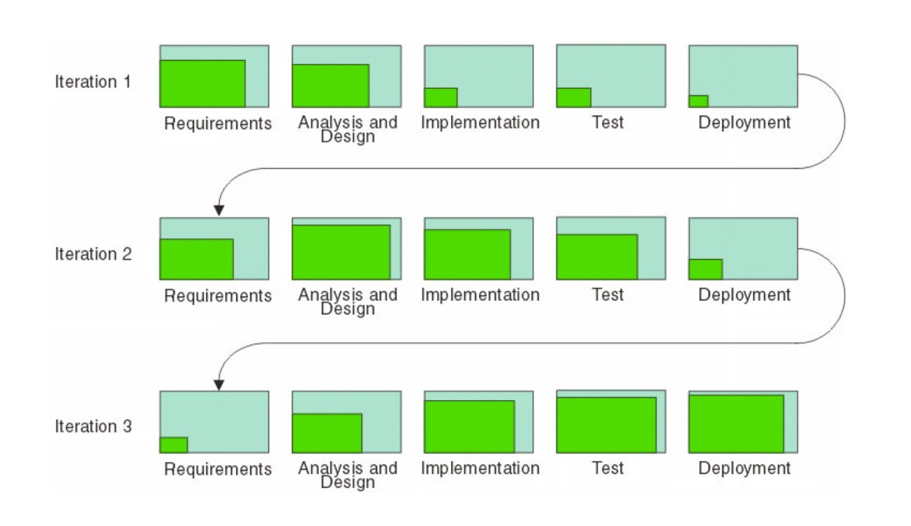

# Software Development Process

## Software Process Model 이란?

### Process Models
- 개발의 혼란을 막기 위해서 누가 어떤것을, 언제 , 어떻게 목표달성 할 것인지 정해놓은 모델들 
- 대표적인 모델은 아래에 있다.
### Typical Process Models
1. `Waterfall Model`
1. `Incremental Model`
1. Evolutionary Models ( `Prototyping` , `Spiral` )
1. Specialized Model ( `Component-Based Development` , `Formal Methods` )
1. `Iterative Model` ( `Agile` )
1. `Unified Process` ( `RUP` )

### 2가지 프로세스 
1. Planed-driven Processes 
    - 사전에 계획된 대로 개발한다.
    - process 는 이 계획을 바탕으로 평가된다. 
1. Agile Processes 
    - 계획은 점진적으로 이루어진다.
    - 고객의 요구사항 변화에 맞춰 프로세스가 변경된다.

### `Waterfall Model`

- 특징
    - `documentation`이 굉장히 `heavy`하다
    - 요구사항이 정해져 있는경우 , 일이 순차적으로 진행된다. 
    - oldest paradigm
- 순서
    1. Communication
    1. Planning
    1. Modeling
    1. Construction 
    1. Deployment 
- 단점 
    - 고객의 요구사항 변화에 맞추기 어렵다
    - `앞의 단계가 끝나지 않으면 다음 단계로 넘어갈 수 없다.`
    - deploy가 늦게 되기 때문에 고객의 feedback 을 기대하기 어렵다
- 언제 쓰이는지?
    - 정확한 요구사항이 정해진 경우에( 변경되지 않는 경우 ) 쓰이면 좋다.
    - 개발이 굉장히 큰 경우에도 쓰인다
    - 항공 , 군사 , 우주 산업 등...

### `Incremental Model `
- Waterfall + Iterative
- 특징
    - 점진적으로 향상된 결과물이 `반복적으로 release` 된다.
    - 전체 프로젝트를 `세분화` 시켜서 개발한다.
    - `each cycle` 마다 고객에게 `feedback` 을 받는다.
    - 고객의 변화를 받아들이는 비용이 줄어든다.
- 단점 
    - `Project 를 management` 하기 힘들다 ( PM이 힘들다. )
    - 모든 버전을 정리하기 어렵다.
    - 결국 `documentation`이 어렵다
    - 구조적으로 엉망이 될 확률이 높다.
- 언제 쓰이는지?
    - small ~ medium size 
    - `parts of` large system

### `Evolutionary Model`
- 2가지 모델이 있다.
    - prototyping , spiral 
#### `Prototyping Model`
- 고객이 요구사항의 디테일을 정해주지 않았을 때 사용한다.
- 혹은 개발자가 알고리즘에 대한 확신이 없거나 특정 OS에 대한 기능이 의심될 때 사용
- 보통 다른 `모델 프로세스 중간`에 사용된다. 

#### `Spiral Model`
- 각 루프가 나선형 구조를 이룬다.
- 고정된 phase가 존재하지 않는다.
- `위험관리`가 핵심이다. (risk analysis)
- 마지막에는 결국 waterfall이라고 할 수 있다.
- 구조
    - Objective setting 
        -  구체적인 목표가 각각의 단계마다 정해진다
    - RiskAssessment and reduction
        - `위험관리`
    - Development and validation
        - 개발할 모델이 정해진다.
    - Planning
        - 프로젝트를 리뷰하고 `다음` 나선형 phase를 준비한다.

### `Specialized Model`
- 2가지 모델 
    - Component-Based Development , Formal Method
#### `ComponentBased Development`
- 쉽게 말해서 오픈 마켓에서 요소들을 구매한 뒤 사용한다.
- 단계 
    1. 가능한 component 들이 평가된다
    1. component들을 합쳤을때 이슈를 생각한다
    1. sw architecture를 거기에 맞춰 변경한다.
    1. architecture에 component들을 병합한다.
    1. testing 
- 하지만 보통 class는 너무 작은 단위라서 기회비용이 맞지 않아 잘 사용하지 않는다.
#### `Formal Method`
- 수학적으로 사용할때 ( 함수들 )
- 보통 검증을 위해서 사용된다.
- 안전이 최우선되는 프로젝트에 사용된다.
    - ex ) 핵관시 시설 , 철도 , 인공위성 등등...

### Iterative Model - `Agile`
- Agile은 빠르게 개발하는 프로세스들의 대표적인 단어
- 특징
    - short iterative cycles(2~3 weeks)
    - 고객의 참여를 필요로한다
    - 팀의 집중도가 요구된다.
- 반드시 포함해야 할것
    1. Iterative `반복`
    1. Incremental `점진성`
    1. Self-organizing `지속적으로 최선책을 찾는다 `
    1. process not determined `변화에 순응한다`
    1. `개개인의 역량`이나 `communication`이 중요

### `Agile (detail)`
- 특징
    - 겨우 작동하는 것을 만들고 점차 변경하자 !
    - 변화가 일어날 수 밖에 없다는 것을 인정하고 순응하자
    - `working software` > `ducumentation` 
    - 계약을 넘어선 고객의 참여가 필요!
- 단점 ( 문제점 )
    - 고객의 지속적인 참여는 쉽지 않다.
    - 팀원들의 집중력이 떨어질 수 있다. ( 지속적으로 유지하기 힘들다. )
    - 이해당사자(`stake holders`)가 많은 경우 우선순위를 정하기 힘들다
    - `refactoring`이 필수 불가결하다.
    - `documentation` 에 약하다. 따라서 계약할 때 힘들다.

### `Rational Unified Model` ( `RUP` )
- 특징
    - Iterative `반복`
    - Architecture centric `구조 중심적`
    - UseCase driven `유즈케이스 기반`
- `Well-defined` and `Well-structured` process

- `Spirits of RUP`
    - Attack  major risk `early` and `continuously`
    - `실행 가능한 sw`를 만드는것에 집중해라
    - `Acommodate change early` (적절한 변화를 빠르게 적용해라)
    - Build System with `component`
- 결국 `RUP` 또한 `Iterative development process`

#### Dynamic Structure of RUP : `4 Phase` 
1. `Inception Phase`
    - `scope`를 정하고 프로젝트의 `lifecycle`을 정한다.
1. `Elaboration Phase`
    - `mitigate risk` and create `stable baseline architecture` 
1. `Construction Phase`
    - `Develop the remainders` ( efficiently )
1. `Transition Phase`
    - `customer acceptance` of the product

#### Dynamic Structure of RUP : `Iterations`
- `resulting in an excutable release`

