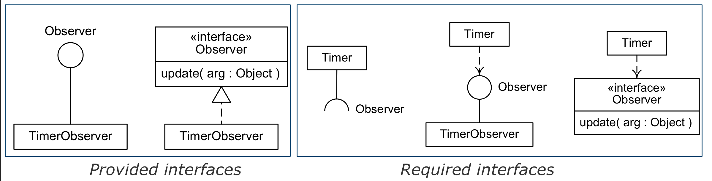

# UML Class Diagram

- Individuals of System
- Notation
    - Class Name : Class
    - attribute = current value
    - Anonymous Object

## Object Diagram
- `instance diagram` 이라고도 한다.
- 특정한 순간의 스탭샷이다

## from Object to Class
- Object는 class의 인스턴스 이다.
- Object는 다음 세가지를 가지고 있다
    1. Class name
    1. Attributes 
    1. Operations
- Instance variable(= Instance attribute)
    - 인스턴스에 할당된 특성을 가르키는 말  
- class variable (= class attribute , static attribute)
    - 한번만 정의되고 모든 인스턴스가 공유한다.
- class operation (= static opertion)   
    - 인스턴스가 없는 경우에 사용 가능

## Abstract Operations and Classes
- Abstract Operation 은 바디가 없다 
- Abstract class 는 인스턴스화 할수 없다. 
- concrete 는 반대다
- 추상 메소드가 있으면 무조건 추상 클래스
- 추상 메소드가 없어도 추상 클래스 일수도 있다.
- 이태리체로 표현 or <<>> or {abstract}

## Interface
- 
- Provided interfaces , Required interfaces
