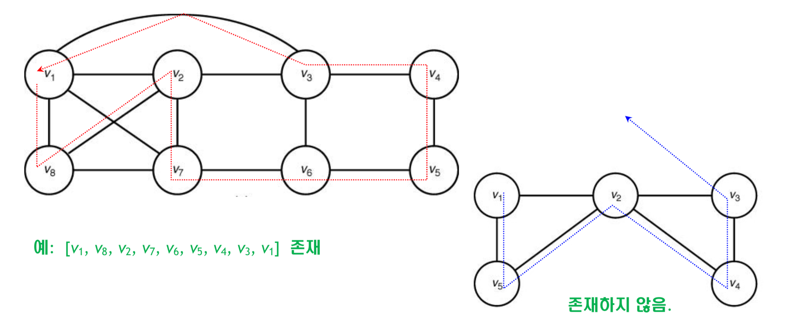
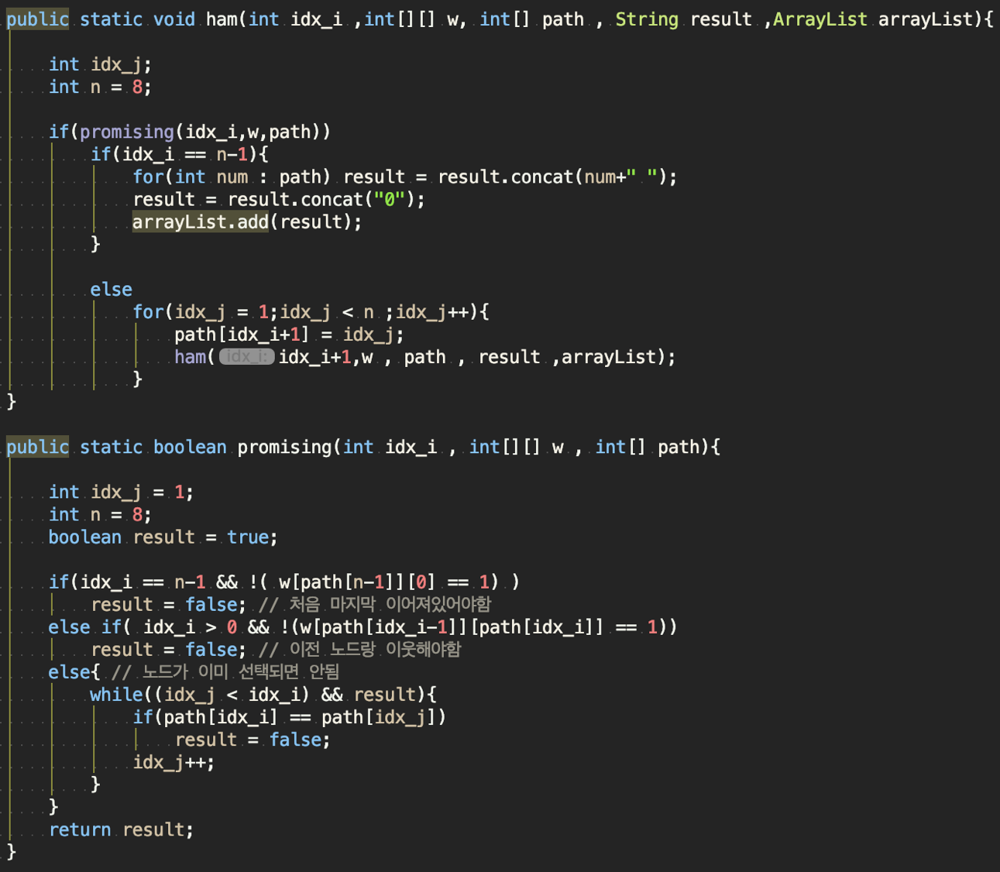
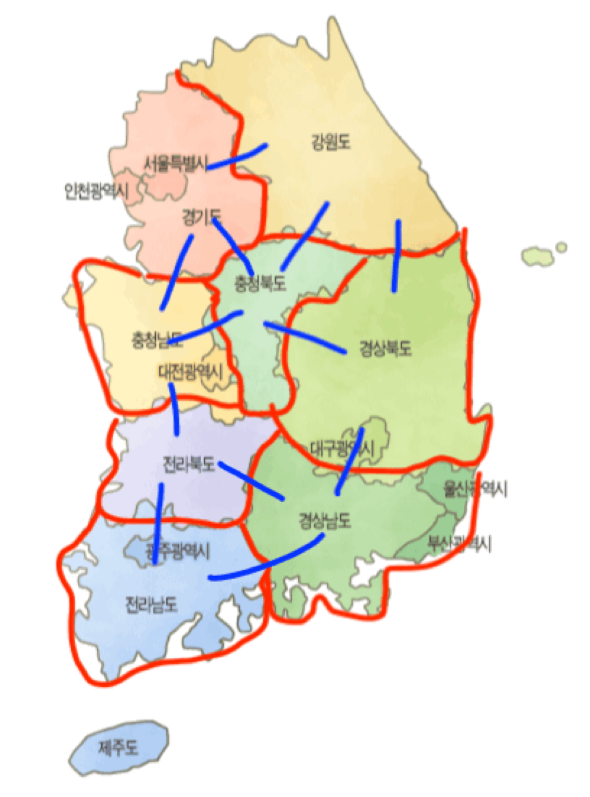

# Problem Solving

저의 알고리즘의 핵심은 두가지 입니다. 경로를 구하는것 그리고 더 나은경로를 추천해 주는 것

이번주에는 경로에 대해서 한번 생각해보려고 합니다.

## path -> hamiltonian circuit

`hamiltonian circuit` 알고리즘을 활용하여 전국일주 경로를 짜려고 합니다.

위와 같은 경로를 짜는 알고리즘을 hamiltonian circuit 이라고 합니다. 이를 통해서 전국을 팔도로 나누어 접근할 수 있는 지역을 기반으로 경로를 만들 생각입니다.

- 참고 사진 ( 나눈 기준 )
    - 

접근할 수 있는 지역은 다음과 같습니다
- 서울 ( + 경기도 )
- 강원도
- 충청북도
- 충청남도
- 전라북도
- 전라남도
- 경상북도
- 경상남도

위에 표시한 지역을 노드로 합니다. 출발점은 서울이며 다시 서울로 돌아온다고 가정합니다.

이제 이를 통해서 weight값에 우선순위를 둔 경로를 찾을 계획입니다.

