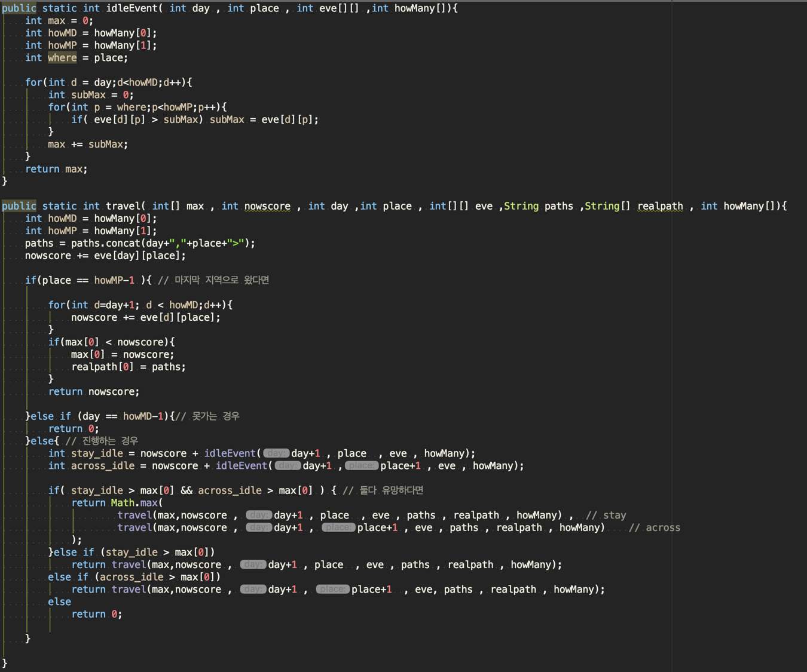

# Problem Solving

저번주 problem Solving에 이어서 

저는 이번주에 더 나은 경로를 추천해 주는 것에 대해서 문제를 해결하고자 합니다.

## weight 

경로와 지역에 그리고 날짜에 따라서 값이 변동됩니다. 예를 들어보겠습니다.

- 3일동안의 여행에서 서울 , 강원도 , 경상북도 를 체험하고 싶다고 한다면
    - 첫째날에 는 서울에서 출발이기 때문에 고려하지 않습니다.
    - 이틀째 되는날에 강원도에 5개의 문화체험, 경상북도에 10개의 문화체험이 있습니다.
    - 3일째 되는날에 강원도에 10개의 문화체험 경상북도에 5개의 문화체험이 있습니다.

위와 같은 상황이라면 `서울 -> 강원도 -> 경상북도`를 이용한 경로보다 `서울 -> 경상북도 -> 강원도`를 거친 경로를 가는 것이 더욱 많은 문화체험을 하게 될 것입니다.

저는 이러한 과정을 통해서 더 나은 경로를 추천하고자 합니다.

## 구현 

`Branch-and-Bound 전략`을 사용하려고 합니다. 

분기한정 전략으로서 한마디로 모든 노드를 체크하지 않고 일부분만 체크하는 전략입니다. ( 유명한 예시로는 kanpsack problem이 있습니다. ) 

이를 통해서 유망한 ( 점수가 더 높아질 가능성이 있는 ) 노드라면 탐험하고 그렇지 않으면 무시하는 전략으로서 잘만 활용한다면 높은 효율을 얻을 수 있습니다. 저는 이를 idleEvent 함수를 활용해서 구현하였습니다.

전체적인 전략으로 
- 하루에 한개의 지역을 갈 수 있습니다. 
- 하나의 지역에서 오랫동안 머물 수 있습니다.

이 두가지를 유의하여 코드를 작성했습니다.

- 구현 코드
    - 

## Merge 

저번주에 작업한 hamiltonian circuit 을 토대로 총 6개의 경로가 나왔고 , 각각의 경로에 이번주에 구현한 `branch_and_bound 함수`를 이용해 점수를 메겨 가장 높은 점수를 가진 경로를 추천해 줄 생각입니다.

