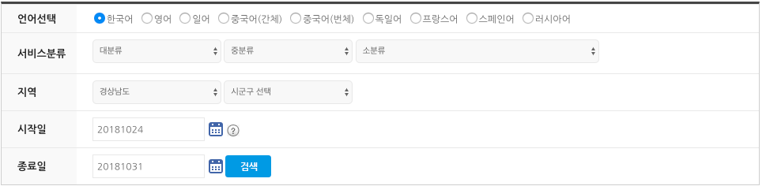

# Implementation & Data Collection

저번주까지 구현한 알고리즘을 사용하기 위해서 데이터를 이제 실제로 가져오려고 합니다.

초반에 말씀드렸듯이 tour api 에 직접 request를 날려서 결과값을 활용하려 합니다.

[TourAPI](http://api.visitkorea.or.kr/guide/inforDate.do)에서 제공한 예시를 토대로 들겠습니다. 먼저 기간과 장소에 맞춘 요청을 할 수 있습니다.

저는 경상남도를 예시로 10/24 ~ 10/31 을 검색해보겠습니다. 

 

요청 URL은 다음과 같습니다. http://api.visitkorea.or.kr/openapi/service/rest/KorService/searchFestival?ServiceKey=인증키&eventStartDate=20181024&eventEndDate=20181031&areaCode=36&sigunguCode=&cat1=&cat2=&cat3=&listYN=Y&MobileOS=ETC&MobileApp=TourAPI3.0_Guide&arrange=A&numOfRows=12&pageNo=1


그러면 아래와 같은 응답이 나오게 됩니다.
```html
<?xml version="1.0" encoding="UTF-8" standalone="yes"?>
<response>
<header>
<resultCode>0000</resultCode>
<resultMsg>OK</resultMsg>
</header>
<body>
<items>
<item>
<addr1>경상남도 거제시 거제면 거제남서로 3485-17</addr1>
<areacode>36</areacode>
<cat1>A02</cat1>
<cat2>A0207</cat2>
<cat3>A02070200</cat3>
<contentid>1732929</contentid>
<contenttypeid>15</contenttypeid>
<createdtime>20121015132933</createdtime>
<eventenddate>20181104</eventenddate>
<eventstartdate>20181027</eventstartdate>
<firstimage>http://tong.visitkorea.or.kr/cms/resource/69/2540869_image2_1.JPG</firstimage>
<firstimage2>http://tong.visitkorea.or.kr/cms/resource/69/2540869_image2_1.JPG</firstimage2>
<mapx>128.5815248580</mapx>
<mapy>34.8518120466</mapy>
<mlevel>6</mlevel>
<modifiedtime>20180328100129</modifiedtime>
<readcount>72846</readcount>
<sigungucode>1</sigungucode>
<tel>055-639-6443</tel>
<title>거제섬꽃축제 2018</title>
</item>

... 

<item>
<addr1>경상남도 창원시 의창구 용지로 179</addr1>
<addr2>(용지동)</addr2>
<areacode>36</areacode>
<cat1>A02</cat1>
<cat2>A0207</cat2>
<cat3>A02070200</cat3>
<contentid>1433165</contentid>
<contenttypeid>15</contenttypeid>
<createdtime>20111110135914</createdtime>
<eventenddate>20181027</eventenddate>
<eventstartdate>20181027</eventstartdate>
<firstimage>http://tong.visitkorea.or.kr/cms/resource/99/2502899_image2_1.JPG</firstimage>
<firstimage2>http://tong.visitkorea.or.kr/cms/resource/99/2502899_image2_1.JPG</firstimage2>
<mapx>128.6822948252</mapx>
<mapy>35.2306797638</mapy>
<mlevel>6</mlevel>
<modifiedtime>20181001165316</modifiedtime>
<readcount>30794</readcount>
<sigungucode>16</sigungucode>
<tel>055-266-8680</tel>
<title>Korea 창원틴틴페스티벌 2018</title>
</item>
</items>
<numOfRows>12</numOfRows>
<pageNo>1</pageNo>
<totalCount>11</totalCount>
</body>
</response>
```

여기에서 areacode와 item의 갯수만 확인하면 제가 필요한 값들을 얻을 수 있습니다.

이를 활용해서 이전에 구현한 알고리즘을 합쳐 구현을 진행하겠습니다.
