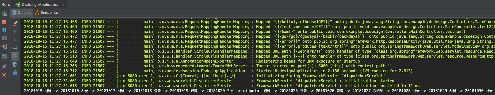

# Testing & Evaluation

구현한 코드는 [이곳](/2018_2/DataStructureDesign/code)에서 확인하실 수 있습니다.

이를 통해서 실제로 테스트를 해보겠습니다.

### 제약사항

먼저 branch-and-bound 전략을 활용하는데 너무 많은 공간메모리가 필요하게 되어서 중간에 경남을 middle point로 잡았습니다.

## 문제 해결

즉 서울 -> 경남 , 경남 , 경남 -> 서울 이렇게 3단계로 나누어 문제를 해결하였습니다.

localhost에서 작업했으며 /starting/s_days/e_starting/e_days 과 같은 URL 을 사용할 수 있습니다. 에를 들어 `/20181015/6/201825/6`라고 한다면 10월15일에 6일동안 서울에서 경남으로 가고, 25일에 6일동안 경남에서 서울로 간다 라는 뜻이라고 생각하면 됩니다.

이에 따른 결과는 다음과 같습니다. 

각 날자에 어디에 있으면 좋을지 console에 출력하였습니다.

