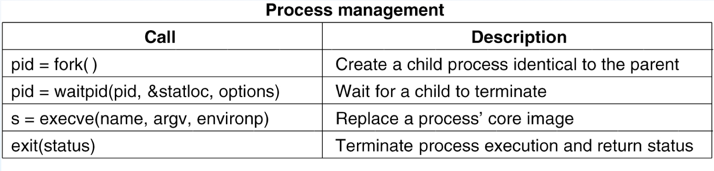
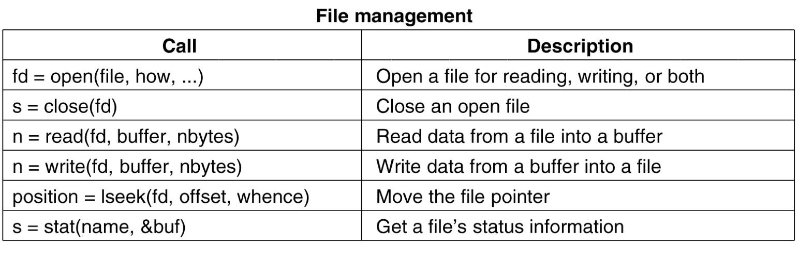
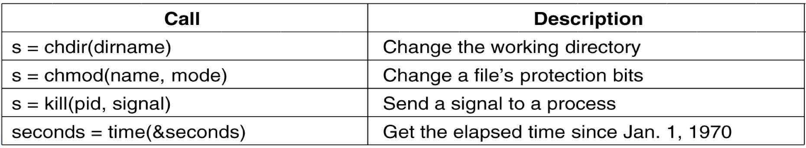

# ch1 introduction

OS는 하드웨어와 사용자의 중간자 역할을 한다.

- OS의 목표
    - 하드웨어를 조금 더 쉽게 사용하도록 한다.
    - 컴퓨터 시스템을 좀 더 편리하게 사용하도록 한다.
    - 하드웨어를 좀 더 효율적으로 사용할 수 있게끔 한다.

OS의 핵심파트는 `OS Kernel` 임을 기억하자. 수업시간에 얘기한 것은 모두 커널

user -> application programs (-> beautiful interface) -> OS(OS `kernel`) -> Hardware

### 컴퓨터 시스템

1. 하드웨어
1. OS
1. Application
1. Users

- system program ? 
    - 다른 시스템을 지원하기 위한 프로그램
    - 대표적으로 OS , DBMS , Complier

### OS 의 정의 ( role )

- 하드웨어 자원을 컨트롤한다.
    - 하드웨어를 resource 라고도 한다.
    - 하드웨어를 동시에 사용하면 충돌이 일어날 수 있는데 이를 해결한다.
    - 공평하게 사용할 수 있도록 한다.

main memory(RAM , ROM) + secondary storage ( C: D: ...)

메인 메모리에 있어야 CPU 에서 바로 읽을 수 있다. 

윈도우 설치 -> secondary 디스크에 저장 ( 동작 x ) -> 메인 메모리 ROM or EEPROM (nonvolatile ) 

윈도우를 다 올리는 것이 아니라 항상 돌아가야 하는 kernel 부분만 올려준다.

하드웨어 초기화를 하고 모든 것이 정상인 것을 확인한 후에 램에 있는 것을 사용한다.

위의 과정을 bootstrap program ( boot program , boot loader )

### 컴퓨터의 구성요소

CPU + memory + I/O

# ch2 Operating System Structure

## System Call 중요하다

- system calls
    - OS가 제공하는 API 이다.
    - 시스템에서 제공하는 서비스를 사용하기 위해서 호출하는 것
- API ( Application Program Interface)

유저가 system call을 직접 사용하기 이전에 API 를 사용한다. API 가 더 편하다.

1. library 에서 printf 라는 API를 호출한다.
1. 이 printf 가 OS의 write(System Call)라는 함수를 호출하는 로직이 있다.
    - 이 write도 2단계로 되어 있다.
1. 이를 통해서 화면(HW)에 출력이 된다.

마지막에는 System Calls -> Kernel -> Device Drivers -> HW

user mode와 kernel mode 는 나누어져 있는데 kernel 모드에 함부로 접근할 수 없도록 하는 로직이 존재한다. 이를 통해서 시스템이 함부로 변경되는 것을 방지한다. 따라서 OS를 지원하는 마이크로세서는 2가지 mode를 제공한다.

## Linux System Call

중간에 kernel mode로 들어갈때 interupt (trap 이라고도 한다. ) 를 호출한다.

## Transition from user to kernel mode

- Dual-mode
    - user mode
    - kernel mode ( privilegde mode )
        - 모든 권한을 다 가지고 있기 때문에
    - 사용하는 메모리 영역이 다르다.
- Mode bit
    - HW에서 전달된 이 비트를 컨트롤 해서 모드를 변경한다.

## Type Of System Call
1. process management 
    - 
1. file management
    - 
1. etc
    - 

    

