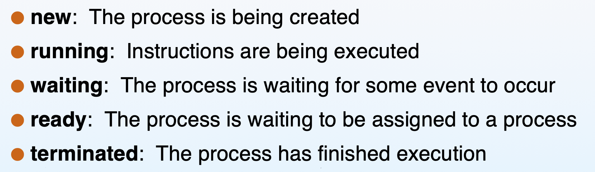
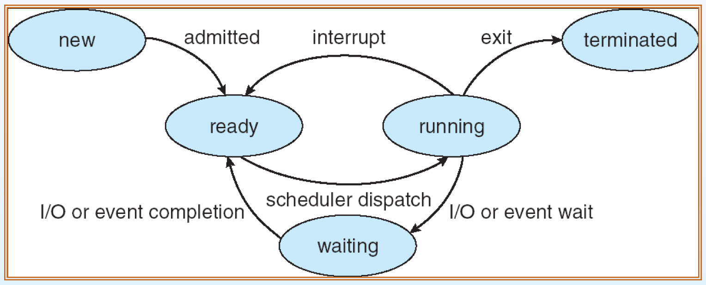

# ch3 Processes ( 가장 중요함 )

프로세스는 실행중인 프로그램이다. 운영체제가 해야할 일은 process를 어떻게 관리하는지가 핵심이기 때문에 job , task 라고도 불린다.

#### process management 의 핵심 중 하나가 process scheduling 이다. 

프로그램이 실행되려면 어디쯤 실행되는 지를 알아야 하는데 , 이를 CPU 안에 있는 레지스터가 가르키고 있어야 한다. 이 주소는 program counter라고 부른다. 

프로그램이 실행된다는 것은 이러한 리소스가 다 포함되서 실행이 되는 것이다.

stak과 heap 의 크기는 유동적이라는 사실을 알아두자 

## Process State

#### 중요하다 그냥 다 외우기 

##### 프로세스 상태에 대해서 그림을 그리고 설명하시오 ( 저번 중간고사 )

1. 프로세스가 생성이 된다. 
1. 실행이 되려면 CPU를 할당을 받아야 한다. 
1. 할당을 받기 전 대기를 한다. 
1. 그리고 준비를 하다가 OS가 CPU를 주면 그때부터 running 상태가 된다. 
1. printf를 실행하면 화면에 출력하기 전 시간보다 더 빠른 시간으로 CPU은 이미 작업이 끝나있다. 그래서 자발적으로 다른 프로세스를 위해서 CPU를 내놓아야 한다. 이 상태가 wating 이다. 
1. 그리고 또 기다리다가 러닝 이런 방식이 반복 되다가. 끝난다.

위의 상황이 프로세스의 life cycle 이라고 할 수 있다.

 
 예를 들어서 자바에서 슬립이라는 함수를 사용했을 때 그동안 CPU를 점유하고 있는 것이 아니라. ready 상태로 돌아가서 자신의 순서를 기다린다. 그 후 자신의 순서가 오면 다시 running 하는 cycle 을 가지고 있다.

 OS는 공평성을 추구하기 때문에 만약 엄청난 시간이 걸린다면 10ms 정보 시간을 주고 점유를 뺏었다가 다시 줄세우는 이런 형식으로 운영한다. 

 ## Process Control Block ( PCB )

 커널이 관리하는 프로세스에 대한 모든 정보를 struct 형태로 저장을 해 놓는다. 

 program counter 도 CPU resister 중 하나이다.

 ## why PCB?

- process switch 를 원활하게 하기 위해서 이다. 
    - 다른말로 context switch 혹은 CPU switch 라고 한다.
    - PCB에 들어가는 모든 것을 문맥(context) 라고 한다.
- 내부에서 일어나는 switch는 보이지 않는다.
    - context-switching time이 길어지면 버벅댄다.
    - 이를 최대한 짧게 잡아야 한다.

 CPU 는 하나이고 Process가 2개라고 하자. 프로세스가 예를 들어서 실행하다가 다른 이유로 인해서 다른 프로세스로 넘어가야 한다면 , 현재 실행중이었던 프로세스의 정보들을 PCB에 저장해 놓아야 한다. 그 후에 다시 Process로 돌아와서 정보들을 보면 다음 실행해야할 곳을 알 수 있다.

