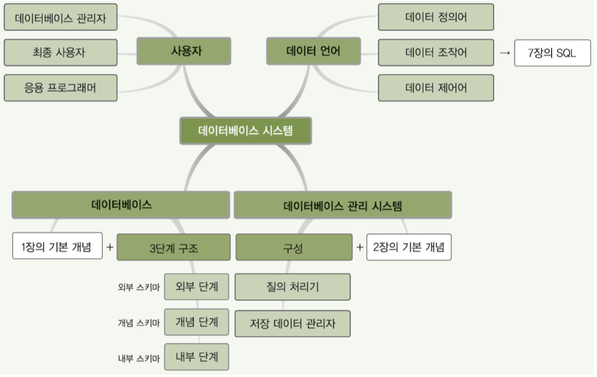
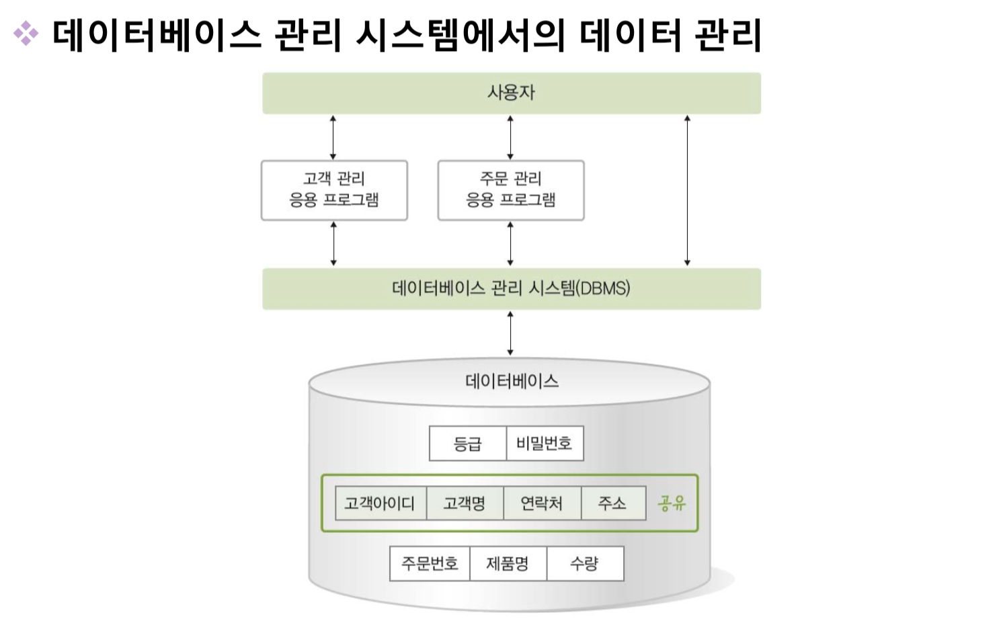

# Week 1 정리 및 해답

## ch 1 

1. 데이터와 정보의 차이는 무엇인가
    - `데이터`는 현실 에서 가져온 값 그대로를 의미하고 의사 결정에 유용하게 활용할 수 있도록 데이터를 처리한 것이  ```정보```이다
1. 정보처리 란 무엇인가
    - 데이터에서 정보를 추출하는 과정 또는 방법을 `정보처리`라고 한다.
1. Raw 데이터는 무엇을 의미하는가
    - 정보 처리를 하기 전 상태 그대로의 데이터를 Raw 데이터 라고 한다.
1. 정보시스템 과 데이터베이스 각각을 설명하여라
    - `정보시스템`이란 조직 운영에 필요한 데이터를 수집해 저장해두었다가 필요할 때 유용한 정보를 만들어 주는 수단이다.
    - `데이터베이스`란 정보시스템 내부에서 데이터를 저장하고 있다가 필요할때 데이터를 제공하는 역할을 한다.
1. DB를 정의하고 관련된 데이터에 대해서 설명하시오
    - `특정 조직의 여러 사용자가 _공유하여 사용할 수 있도록 _통합해서 _저장한 _운영 데이터의 집합`
    - 공유데이터 : 특정 조직의 여러 사용자가 함께 소유하고 이용할 수 있는 공용데이터
    - <b>통합데이터</b> : 최소의 중복과 통제 가능한 중복만 허용하는 데이터
    - 저장데이터 : 컴퓨터가 접근할 수 있는 매체에 저장된 데이터
    - 운영데이터 : 조직의 중 기능을 수행하기 위해 지속적으로 꼭 필요한 데이터
1. DB의 4가지 특성을 설명하시오
    - 실시간 접근 : 사용자의 데이터 요구에 실시간으로 응답
    - 계속 변화 : 데이터의 지속적인 삽입,삭제,수정을 통해 정확한 데이터 유지
    - 동시 공유 : 다른 데이터의 동시 사용뿐만 아니라 같은 데이터의 동시 사용도 지원
    - 내용 기반 참조 : 데이터의 저장된 주소나 위치가 아닌 내용 기반으로 참조
*** 

## ch 2 데이터베이스 관리 시스템

1. 파일시스템이란 무엇인가
    - 데이터를 파일로 관리하기 위해 수정 삽입 삭제등을 제공하는 소프트웨어
1. 파일시스템의 문제점 2가지를 설명하시오
    - 여러 파일이 중복 저장된다.
        - 같은 내용의 데이터가 여러 파일에 중복 저장이 된다 -> 데이터 중복성
        - 이는 저장 공간의 낭비 , 데이터 일관성과 무결성을 유지하기 어렵다.
    - 응용 프로그램이 데이터 파일에 종속적이다.
        - 사용하는 파일의 구조를 변경하면 응용프로그램 또한 변경되어야 한다.
1. 데이터의 일관성과 무결성은 무엇인가
1. DBMS란?
    - 데이터베이스 관리 시스템 
    - 파일시스템의 문제를 해결하기 위해서 제시된 소프트웨어
    - 조직에 필요한 모든 데이터를 DB에 통합하여 저장하고 관리함 
1. DBMS의 주요기능 3가지
    - 정의 : 데이터베이스의 구조를 정의하거나 수정할 수 있다,
    - 조작 : 데이터를 삽입 삭제 수정 검색하는 연산을 할 수 있다.
    - 제어 : 데이를 항상 정확하고 안전하게 유지할 수 있다.

1. 1 ~ 3 세대 대표적인 DBMS와 특징은 무엇인가
    - 1세대 : 네트워크 DBMS => 그래프  , 계층 DBMS => 트리
    - 2세대 : 관계 DBMS
    - 3세대 : 객체지향 DBMS , 객체관계 DBMS
***

## ch 3 데이터베이스 시스템

1. 데이터베이스 시스템이란 무엇인가 ( DBS )
    - 데이터베이스에 데이터를 저장하고 , 이를 관리하여 조직에 필요한 정보를 제공하는 시스템
1. 스키마와 인스턴스란 무엇인가
    - 스키마 : 데이터베이스에 저장되는 `데이터구조`와 `제약조건`을 정의한것
1. 3단계 데이터 베이스 구조를 설명하고 그들의 특징과 추상화 레벨에 대해서 설명하여라
    - 외부 단계 : 개별 사용자 관점에서 이해하고 표현하는 단계 , 외부 스키마는 여러개가 존재할 수 있다. `서브스키마`라고도 한다.
    - 개념 단계 : 조직 전체의 관점에서 이해하고 표현하는 단계 , 개념 스키마는 1개만 존재한다. 
    - 내부 단계 : 저장 장치 관점 
    - 외부단계의 추상화 레벨이 가장 높다.
1. 데이터베이스 구조의 사상(매핑) 이란 무엇인가
    - 스키마 사이에 대응관계
    - 외부/개념 사상 (응용 인터페이스) : 외부 스키마와 개념 스키마의 대응관계
    - 개념/내부 사상 (저장 인터페이스) : 개념 스키마와 내부 스키마의 대응관계
1. 데이터베이스 구조의 사상은 왜 만들어졌는가
    - 데이터 독립성을 위해서 만들어짐
1. 데이터 독립성의 정의와 2가지 데이터 독립성에 대해서 설명하여라
    - 데이터 독립성 : 하위 스키마가 변경 되더라도 상위 스키마는 영향을 받지 않는 특성
        - 논리적 독립성 : 개념 스키마가 변경이 되더라도 외부 스키마는 영향을 받지 않는다
            - 응용 인터페이스만 수정해주면 된다.
        - 물리적 독립성 : 내부 스키마가 변경이 되더라도 개념 스키마는 영향을 받지 않는다.
            - 저장 인터페이스만 수정해주면 된다.
1. 데이터사전(시스템카탈로그) 란 무엇인가
    - 메타데이터를 유지하는 시스템 데이터 베이스
    - 메타데이터란 데이터베이스에 저장되는 데이터에 관한 정보를 말한다. 
    - DBMS가 스스로 생성하고 유지한다.
    - 일반 사용자의 제한적인 수준의 접근이 가능하다
1. 데이터 디렉토리란 무엇인가
    - 데이터 사전에 있는 데이터에 실제로 접근하는데 필요한 위치 정보를 가지고 있는 시스템 데이터 베이스
    - 일반 사용자의 접근은 허용되지 않는다.
1. 사용자 데이터 베이스란 무엇인가
    - 사용자가 실제로 이용하는 데이터가 저장되어 있는 데이터 베이스
1. 데이터베이스 사용자를 3가지 분류로 구분하고 설명하여라
    - 데이터베이스 관리자(DBA)
        - 데이터베이스 시스템을 운영하고 관리하는사람
        - 주로 데이터 정의어(DML)과 데이터 제어어(DCL)을 사용한다.
    - 최종 사용자(end user)
        - DB에 접근하여 데이터를 조작(삽입 삭제 수정 검색)하는 사람
            - 이때 데이터 검색을 쿼리로 한다.
        - 주로 데이터 조작어 사용 (DML)
    - 응용 프로그래머
        - 데이터 언어를 삽입하여 응용프로그램을 작성하는 사람
        - 데이터 조작어(DML) 사용
1. 데이터 언어의 정의와 분류 3가지를 설명하여라
    - 데이터 언어란 사용자와 데이터베이스 관리 시스템간의 통신수단이다.
    - 사용 목적에 따라서 아래 3가지 분류로 나뉜다.
    - 데이터 정의어 (DDL)
        - 스키마를 정의하거나 수정 또는 삭제하기 위해서 사용된다.
    - 데이터 조작어 (DML)
        - 데이터의 추가 수정 삽입 삭제 등을 위해서 사용되는 언어
        - 절차적 데이터 언어와 비 절차적 데이터 언어로 나뉜다.
            - 절차적 데이터 언어는 구체적으로 어떻게 해야할지 까지 알려준다 (how)
            - 비 절차적 언어는 구체적은 사항은 얘기해주지 않는다. (how x)
    - 데이터 제어어 (DCL)
        - 사용자와 
    
1. DMBS의 구성을 그려보시오


*** 

## 참고

- 데이터베이스 시스템


- 데이터베이스 관리 시스템


