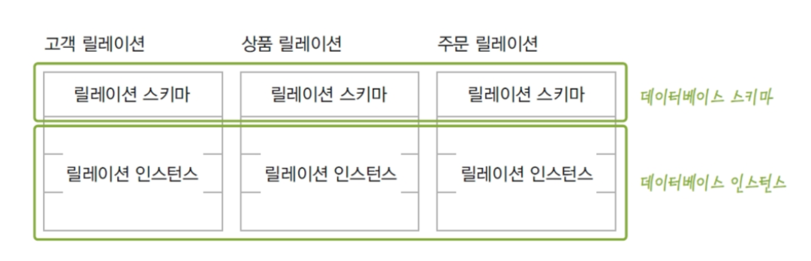
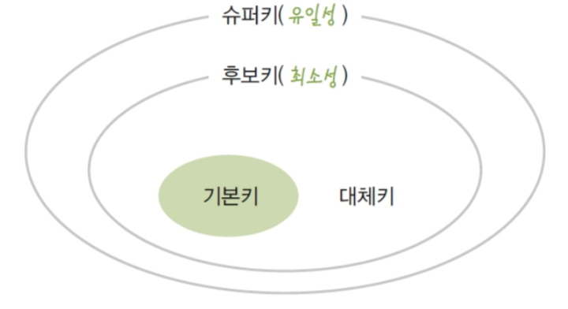
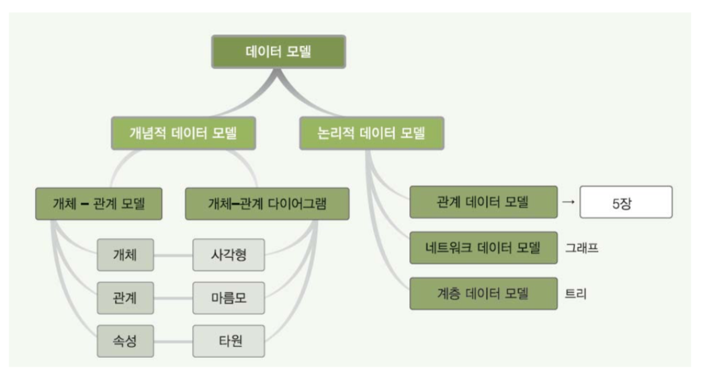
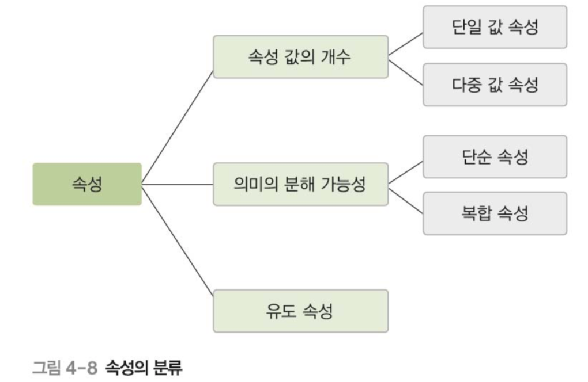
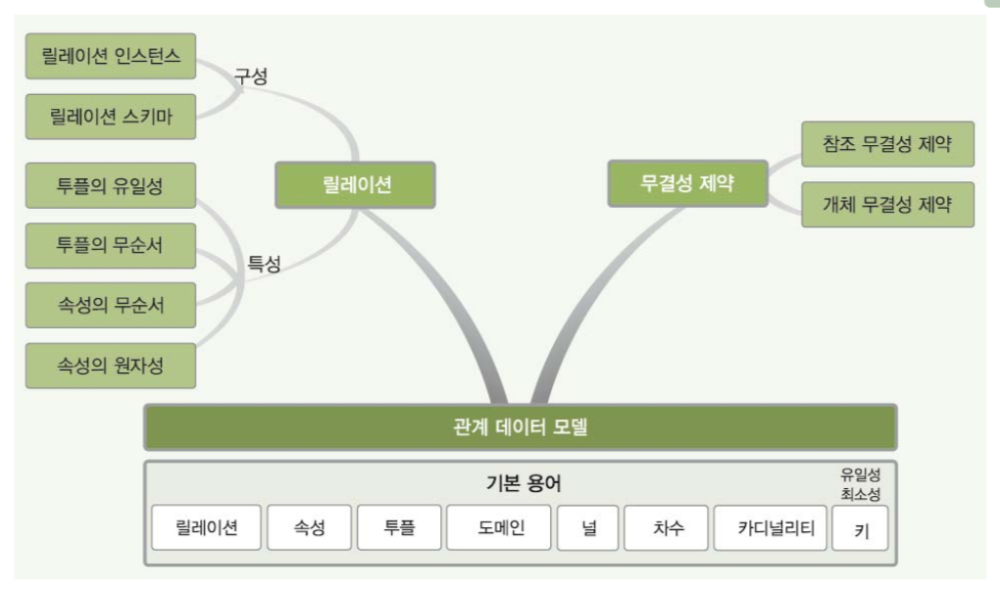
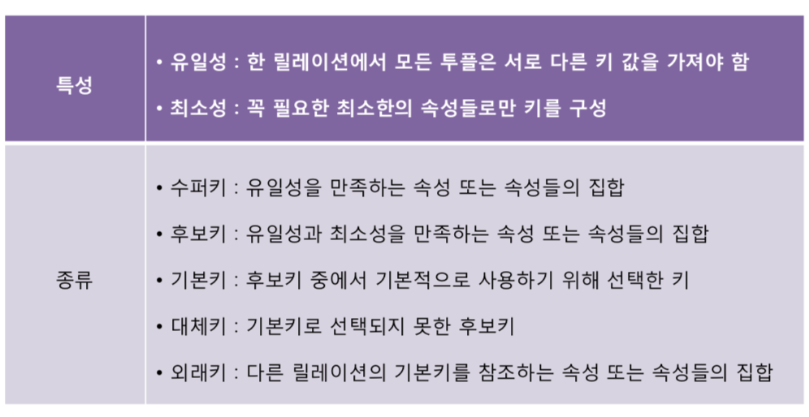

# Week2 TEST

# ch 4 데이터 모델링

## ch 4-1 데이터 모델링의 개념

1. 데이터 모델링이란 무엇인가
    - 현실세계에 존재하는 데이터를 컴퓨터에 데이터 베이스로 옮기는 과정
1. 추상화란 무엇이고 언제 발생하는가
    - 데이터 모델링을 할 때 발생하고 `abstraction` 이라 불리며 손실압축이라고 불린다.
1. 2단계 데이터 모델링을 설명하여라
    - 개념적 데이터 모델링 : `현실세계 -> 개념세계` 로 중요 데이터를 추출하여 옮기는 과정을 말하며 , 특징화를 한다.
    - 논리적 데이터 모델링 : `개념세계 -> 데이터베이스` 로 데이터를 저장하는 구조를 표현하는 작업
1. 데이터 모델을 설명하고 결과물로 나오는 모델을 2단계 모델과 더불어 설명하여라
    - 데이터 모델 : 데이터 모델링의 결과물을 표현하는 도구
    - 개념적 데이터 모델 : 사람의 머리로 이해할 수 있도록 개념적인 형태로 모델링 하여, `데이터 베이스의 개념적 구조`로 표현하는 도구
    - 논리적 데이터 모델 : 개념적 구조를 논리적 형태로 모델링하여, `데이터 베이스의 논리적 구조`로 표현하는 도구

***

## ch 4-2 개체 - 관계 모델
1. 개체 - 관계 모델과 다이어그램을 설명하여라
    - `개체 - 관계 모델`은 개체와 개체간의 관계를 이용해 현실 세계를 개념적 구조로 표현한 것
    - 핵심요소는 `개체 관계 속성` 이렇게 3가지이다.
    - 이를 그림으로 나타낸 것이 `개체-관계 다이어그램`이다.
        - `E-R model -> 그림 -> E-R diagram`
1. 개체란 무엇이고 다이어그램에서 어떻게 표현되는가?
    - 개체란 구별되어 표현할 수 있는 모든 것을 개체라고 부른다. (`Entity`)
    - 다른 개체와 구별되는 이름을 가지고 있고 각자 고유한 특성이나 상태 , 즉 `속성`을 하나 이상 가지고 있다.
    - 파일 구조의 `레코드`와 대응됨
    - 개체는 다이어그램에서 `사각형`으로 표시된다.
1. 속성이란 무엇이고 다이어그램에서 어떻게 표현되는가?
    - 개체나 관계가 가지고 있는 고유한 특성 (`Attribute`)
    - 파일 구조의 `필드`와 대응됨
    - 다이어그램에서 `타원`으로 표현이 된다.
1. 개체 타입 , 개체 인스턴스 , 개체 집합을 설명하여라
    - 개체 타입 : 개체를 고유의 이름과 속성들로 정의한것
        - 파일 구조의 `레코드 타입`과 대응됨
    - 개체 인스턴스 : 개체를 구성하고 있는 속성이 실제 값을 가짐으로서 `실체화`된 개체 
        - 파일 구조의 `레코드 인스턴스`에 대응됨
    - 개체 집합 : 특정 개체 타입에 대한 개체 인스턴스를 모아놓은 것
1. 아래 그림에 빈칸에 들어갈 말은?

    - 개체 이름 , 속성 , 개체 타입 , 개체 인스턴스 , 개체 집합 

- 아래 문제들은 다이어그램에서 어떻게 표현되는지 또한 생각해야 한다.
1. 개체의 속성 중 단일 값 속성과 다중 값 속성에 대해서 설명하여라
    - 단일 값 속성 : 값을 하나만 가질 수 있는 속성
        - `타원`으로 표시
    - 다중 값 속성 : 값을 여러개 가질 수 있는 속성
        - `이중 타원`으로 표시 
1. 개체의 속성 중 단순 속성과 복합 속성에 대해서 설명하여라
    - 단순 속성 : 더 이상 의미를 분해할 수 없는 속성
    - 복합 속성 : 의미를 분해해서 여러개로 나눌 수 있는 속성
        - ex) 생년월일 -> 년 월 일 ( 의미 세분화 가능 )
1. 개체의 유도 속성에 대해서 설명하여라
    - 유도 속성이란 처음에는 값이 정해져 있지 않고 다른 값들에 의해 정해지는 속성
    - `점선 타원`으로 표시
1. 개체의 널 속성과 널 값에 대해서 설명하여라
    - 널 속성 : `널 값이 허용`되는 속성
    - 널 값 : 아직 정해지지 않은 값 혹은 모르는 값일때 NULL 을 사용
        - `공백이나 0 과는 의미가 다르다`
1. 개체의 키 속성에 대해서 설명하여라
    - 각 개체 인스턴스를 구분할 수 있는 유일한 속성
        - `밑줄`로 표시
1. 개체의 관계에 대해서 설명하고 동의어는 무엇인가
    - 개체와 개체가 맺고있는 의미 있는 연관성
    - 개체 집합들 사이의 대응관계 , `매핑(mapping)` 을 의미
        - `마름모`로 표현
1. 관계의 유형 ( 관계 타입의 수 기준 ,매핑 카디널리티 기준 ) 각각 3가지를 설명하여라 
    - 관계 타입 수 기준
        1. 이항 관계 : 두개의 개체가 맺고 있는 관계 
        1. 삼항 관계 : 세개의 개체가 맺고 있는 관계 
        1. 순환 관계 : 개체 타입 하나가 자기 자신과 맺고 있는 관계
    - 매핑 카티널리티 기준
        1. 일대일 관계 : 각 개체의 인스턴스가 상대 개체 인스턴스와 하나씩만 관계를 맺는다.
        1. 일대다 관계 : 하나의 개체 인스턴스는 상대 개체 인스턴스와 여러개의 관계를 맺고 반대로는 하나의 관계만 맺을 수 있다. -> 하나만 여러개의 관계 나머지 하나는 하나의 관계
        1. 다대다 관계 : 각자 개체 인스턴스는 여러개의 관계를 맺을 수 있다. 
1. 매핑 카디널리티란 무엇인가
    - 개체 인스턴스가 다른 개체 인스턴스와 관계를 맺는 수
1. 관계의 참여 특성 2가지를 설명하여라 
    - 필수적 참여 : 모든 개체 인스턴스가 관계에 반드시 참여해야 한다.
        - `이중선`으로 표시
    - 선택적 참여 : 개체 인스턴스 중 일부만 관계에 참여해도 상관없음
1. 오너개체와 약한개체를 설명하여라
    - 오너 개체 : 다른 개체의 존재 여부를 결정하는 개체
        - 약한 개체와 일대다 관계를 가지고 , 약한 개체는 오너 개체와의 관계에 필수적 참여하는 특징이 있다.
    - 약한 개체 : 다른 개체의 존재 여부에 의존적인 개체
        - 약한 개체는 오너 개체의 키 값을 포함하여 키를 구성한다.
    - 약한 개체는 `이중 사각형` 약한 개체가 오너 개체와 맺는 관계는 `이중 마름모`로 표현
1. 개체 다이어그램을 그려보자 아래 특성에 맞는 도형을 생각하여라
    - 개체를 표현 : 사각형
    - 관계를 표현 : 마름모
    - 속성을 표현 : 타원
    - 각 요소를 연결 : 선 
    - 일대일 , 일대다 , 다대다 관계를 표기 : 레이블

***

## ch 4-3 논리적 데이터 모델 

1. 논리적 데이터 모델의 개념과 특성에 대해서 설명하시오
    - E-R 다이어그램으로 표현된 개념적 구조를 데이터 베이스에 저장할 형태로 표현한 논리적 구조
    - `데이터베이스의 논리적 구조 : 데이터베이스 스키마`
1. 논리적 데이터 모델 3가지를 말하고 설명하시오
    - 관계 데이터 모델 : 논리적 구조가 2차원 테이블 형태
    - 계층 데이터 모델 : 논리적 구조가 트리 형태이다
        - 루트 역할을 하는 개체가 존재하고 , 사이클은 없다.
        - `두 개체 사이에 하나의 관계만 정의할 수 있다.`
        - 상하 관계를 가진다. ( 부모와 자식 , 일대다 관계)
        - 구조가 복잡하고 삽입 수정 검색 삭제가 쉽지 않다.
    - 네트워크 데이터 모델 : 논리적 구조가 그래프 형태이다.
        - `두 개체 사이에 여러 관계를 정의할 수 있다.`
        - 오너와 멤버 가 있으며 일대다 관계이다.
        - 구조가 복잡하고 삽입 수정 검색 삭제가 쉽지 않다.

***

# ch 5  관계 데이터 모델

## ch 5-1 관계 데이터 모델의 개념

1. 릴레이션 , 속성 , 투플에 대해서 설명하시오
    - 릴레이션 : 하나의 개체에 대한 데이터를 하나의 2차원 에이블 구조로 정의한 것
        - 파일 관리 시스템에서 파일에 해당
    - 속성 : ( 열 , Attribute) 라고도 함 
        - 파일 관리 시스템에서 필드에 해당
    - 투플 : 릴레이션의 행
        - 파일 관리 시스템에서 레코드에 해당 
1. 도메인 , 널 , 차수 , 카디널리티에 대해서 설명하시오
    - 도메인 : 하나의 속성이 가질 수 있는 모든 값의 집합
        - 속성 값을 입력할 때 적합성 판단의 기준이 된다.
        - 속성의 특성을 고려한 데이터 타입으로 정의
    - 널 : 속성을 아직 모르거나, 정해지지 않은 값 
    - 차수 : 하나의 릴레이션에서 속성의 전체 개수
    - 카디널리티 : 하나의 릴레이션에서의 투플의 전체 개수
1. 릴레이션 스키마와 릴레이션 인스턴스를 설명하고, 스키마는 예제를 작성하시오
    - 릴레이션 스키마 : 릴레이션의 논리적 구조
        - `릴레이션 내포` 라고도 한다.
        - 릴레이션의 이름과 포함된 모든 속성 이름으로 정의
        - 정적인 특성이 있음
        - ex) 고객(고객아이디, 고객이름, 나이, 등급)
    - 릴레이션 인스턴스 : 어느 한 시점에 존재하는 투플들의 집합
        - `릴레이션 외연` 이라고도 한다.
        - 동적인 특성이 있다.
1. 릴레이션의 구성과 데이터베이스의 구성에 대해서 설명하시오
    - `릴레이션 스키마`와 `릴레이션 인스턴스`
    - `데이터베이스 스키마`와 `데이터베이스 인스턴스`
    - 데이터베이스 스키마 : 릴레이션 스키마의 모음
    - 데이터베이스 인스턴스 : 릴레이션 인스턴스의 모음
    - 참고사진
    
1. 릴레이션의 특성에 대해서 설명하시오
    - `투플`의 `유일성` : 동일한 투플이 존재할 수 없다.
    - `투플`의 `무순서` : 하나의 릴레이션에서 투플들의 순서는 무의미하다.
    - `속성`의 `무순서` : 하나의 릴레이션에서 속성들의 순서는 무의미하다.
    - `속성`의 `원자성` : 속성 값으로 원자 값만 사용할 수 있다.
        - 원자성이란 더이상 분해될 수 없는 값으로 되어있다는 말이다 !
1. 키의 정의와 특성 5가지중 외래키를 제외한 4가지를 설명하시오
    - 키 : 릴레이션에서 투플들을 유일하게 구별하는 속성 또는 속성들의 집합
        - `유일성` 과 `최소성`을 만족해야 한다.
    - 수퍼키 : 유일성을 만족하는 속성 또는 속성들의 집합 
    - 후보키 : 유일성을 만족하고 최소성을 만족하는 속성 또는 속성들의 집합
    - 기본키 : 유일성과 최소성을 만족하고 기본적으로 사용하기 위해 선택한 키
    - 대체키 : 유일성과 최소성을 만족하지만 선택되지 않은 키 
    - 참고사진
    
1. 외래키에 대해서 설명하고 특징들을 예시를 들어 나열하시오
    - 외래키 : 다른 릴레이션의 기본키를 참조하는 속성 또는 속성들의 집합
        - 릴레이션들 간의 관계를 표현
        - `참조하는 릴레이션` : 상대 릴레이션의 기본키를 자신의 외래키로 가진다. 
        - `참조되는 릴레이션` : 자신의 기본키가 다른 릴레이션에 의해서 참조되고 있다.
    - 외래키 속성과 그것이 참조하는 기본키의 `이름은 달라도 되지만 , 도메인은 같아야 한다.`
    - 하나의 릴레이션에 외래키가 여러개 존재할 수도 있고, `외래키를 기본키로 사용 할 수도 있다.`
    - 같은 릴레이션 기본키를 참조하는 외래키를 만들수도 있다. 그리고 `외래키는 널 값을 가질수도 있다.`

***

## ch 5-2 관계 데이터 모델의 제약

1. 무결성 제약조건에 대해서 설명하시오
    - 데이터의 무결성을 유지하고 일관된 상태로 유지하기 위한 조건
    - 데이터의 무결성 : 데이터를 `결함이 없는` 상태, `정확`하고 `유효`하게 유지하는것
1. 무결성 제약조건 2가지에 대해서 설명하시오
    - `개체` 무결성 제약조건 : 기본키를 구성하는 모든 속성은 널 값을 가질 수 없는 규칙
    - `참조` 무결성 제약조건 : 외래키는 참조할 수 없는 값을 가질 수 없는 규칙
        - 외래키의 대상이 되는 `기본키의 값 중에 하나`로 외래키의 값이 들어와야 한다.
        - `단 외래키의 값이 NULL값이 될 수도 있다`. 이런 경우에는 참조 무결성 제약조건을 위반한 것이 아니다.

***

## 참고 

- 데이터 모델

- 속성의 특징

- 관계 데이터 모델

- 키의 특성과 종류

