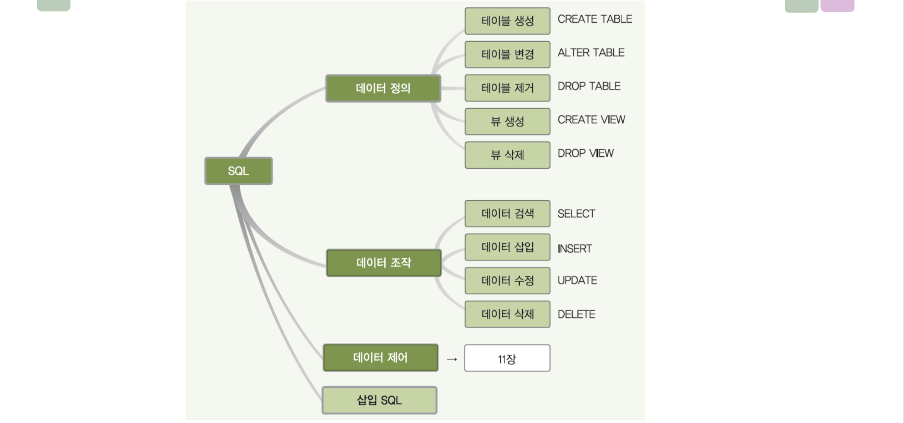

# 7장 데이터 베이스 언어 빠르게 정리
# 항상 세미콜론 잊지말자

## SQL 
- 의미 2가지
    1. 관계 데이터베이스를 위한 `표준 질의어`
    1. `비절차적` 데이터 언어
- 사용 방식
    1. 대화식 SQL : 직접 데이터베이스 관리 시스템에 접근해 질의를 실행
    1. 삽입 SQL : 프로그래밍 언어로 작성된 응용 프로그램에 삽입
    
## SQL 분류 3가지
1. `DDL` : 데이터 정의어 
    - 테이블 자체에 관련되어있다.
    - 테이블을 생성하고 변경 제거 하는 기능을 제공한다. (= `스키마 컨트롤`)
2. `DML` : 데이터 조작어
    - 테이블 내에 데이터 관련
    - 테이블에 새 데이터를 삽입 , 저장된 데이터를 수정 삭제 검색 하는 기능을 제공
1. `DCL` : 데이터 제어어 
    - DBA 만 접근이 가능
    - 보안을 위해 데이터에 대한 접근 및 사용 권한을 사용자별로 부여하거나 취소

## DDL
1. CREATE TABLE
    - CEATE TABLE 테이블이름{}  
    - 5가지 속성이 있다. 
    1. 속성
        - NOT NULL 속성, DEFAULT 속성
    1. 기본키
        - PRIMARY KEY(고객아이디)
    1. 대체키
        - UNIQUE(고객이름)
    1. 외래키
        - FOREIN KEY(외래키) REFERENCES 테이블(테이블속성)
        - ON UPDATE/DELETE ( NO action, cascade, set null, set default )
    1. 무결성 제약 조건
        - CONSTRAIN은 고유한 이름을 부여하기 위한것이고 `CHECK`가 핵심이다.
        - CONSTRAIN CHK CHECK(조건);
        - CHECK(조건)
2. ALTER TABLE
    - `ALTER TABLE 테이블이름 []`
    1. 새로운 속성 추가
        - [] 자리에 `ADD 속성 속성_타입 [NOT NULL] [DEFAULT_기본값];`
    1. 기존 속성 삭제
        - [] 자리에 `DROP 속성_이름 [CASCADE || RESTRICT];`
        - CASCADE : 함께 삭제
        - RESTRICT : 삭제 거부
    1. 제약조건 추가
        - [] 자리에 `ADD CONTRAIN 제약조건_이름 제약조건_내용;`
        - ADD CONSTRAIN CHK CHECK(나이>=20);
    1. 제약조건 삭제 
        - [] 자리에 `DROP CONTRAIN 제약조건_이름;`
3. DROP TABLE
    - DROP TABLE 테이블_이름 [CASCADE || RESTRICT];
    - CASECADE : 참조하는 다른 테이블도 제거
    - RESTIRCT : 참조하는것이 존재하면 거부

## DML
1. SELECT
    - SELECT [ALL | DISTINCT] 속성리스트
    - FROM 테이블
    - GROUP BY [HAVING]
    - ORDER BY
    - WHERE 조건
    - order by 키워드는 asc,desc 이고, null은 가장 작은 값으로 취급 
    - where 의 키워드는 LIKE , IS NULL , 부속질의문 (IN , > , = , EXISTS)
    - 집계함수는 SELECT 절이나 HAVING 절에서만 사용 가능하다 ! null은 무시한다는것을 기억하자
1. INSERT
    - INSERT INTO 테이블이름(속성_리스트) VALUES (속성값_리스트);
    - INSERT INTO 테이블이름(속성_리스트) SELECT 문; 
    - 이렇게도 가능하다. 결과물이 삽입
1. UPDATE
    - UPDATE 테이블_이름 SET 속성이름=값 , ... [WHERE 조건];
    - 조건이 없는 경우 테이블의 모든 투플에 적용
1. DELETE
    - DELETE FROM 테이블 [WHERE 조건];
