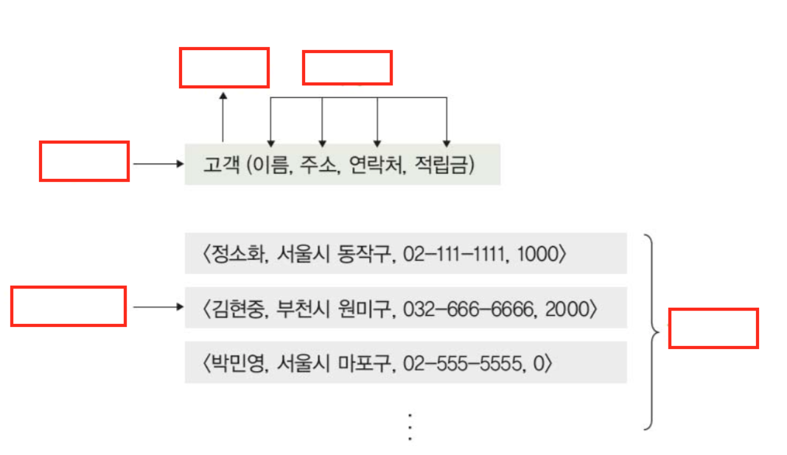

# week2 정리

# ch 4 데이터 모델링 
## ch 4-1 데이터 모델링의 개념

1. 데이터 모델링이란 무엇인가
1. 추상화란 무엇이고 언제 발생하는가
1. 2단계 데이터 모델링을 설명하여라
1. 데이터 모델을 설명하고 결과물로 나오는 모델을 2단계 모델과 더불어 설명하여라

***

## ch 4-2 개체 - 관계 모델
1. 개체 - 관계 모델과 다이어그램을 설명하여라
1. 개체란 무엇이고 다이어그램에서 어떻게 표현되는가?
1. 속성이란 무엇이고 다이어그램에서 어떻게 표현되는가?
1. 개체 타입 , 개체 인스턴스 , 개체 집합을 설명하여라
1. 아래 그림에 빈칸에 들어갈 말은?

- 아래 문제들은 다이어그램에서 어떻게 표현되는지 또한 생각해야 한다.
1. 개체의 속성 중 단일 값 속성과 다중 값 속성에 대해서 설명하여라
1. 개체의 속성 중 단순 속성과 복합 속성에 대해서 설명하여라
1. 개체의 유도 속성에 대해서 설명하여라
1. 개체의 널 속성과 널 값에 대해서 설명하여라
1. 개체의 키 속성에 대해서 설명하여라
1. 개체의 관계에 대해서 설명하고 동의어는 무엇인가
1. 관계의 유형 ( 관계 타입의 수 기준 , 카디널리티 기준 ) 각각 3가지를 설명하여라 
1. 카디널리티란 무엇인가
1. 관계의 참여 특성 2가지를 설명하여라 
1. 오너개체와 약한개체를 설명하여라
1. 개체 다이어그램을 그려보자 아래 특성에 맞는 도형을 생각하여라
    - 개체를 표현
    - 관계를 표현
    - 속성을 표현
    - 각 요소를 연결
    - 일대일 , 일대다 , 다대다 관계를 표기

***

## ch 4-3 논리적 데이터 모델 

1. 논리적 데이터 모델의 개념과 특성에 대해서 설명하시오
1. 논리적 데이터 모델 3가지를 말하고 설명하시오

***

# ch 5  관계 데이터 모델

## ch 5-1 관계 데이터 모델의 개념

1. 릴레이션 , 속성 , 투플에 대해서 설명하시오
1. 도메인 , 널 , 차수 , 카디널리티에 대해서 설명하시오
1. 릴레이션 스키마와 릴레이션 인스턴스를 설명하고, 스키마는 예제를 작성하시오
1. 릴레이션의 구성과 데이터베이스의 구성에 대해서 설명하시오
1. 릴레이션의 특성에 대해서 설명하시오
1. 키의 정의와 특성 5가지중 외래키를 제외한 4가지를 설명하시오
1. 외래키에 대해서 설명하고 특징들을 예시를 들어 나열하시오

***

## ch 5-2 관계 데이터 모델의 제약

1. 무결성 제약조건에 대해서 설명하시오
1. 무결성 제약조건 2가지에 대해서 설명하시오
