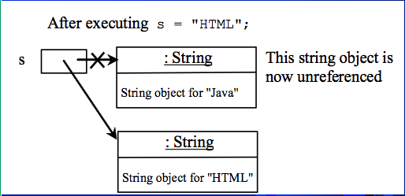
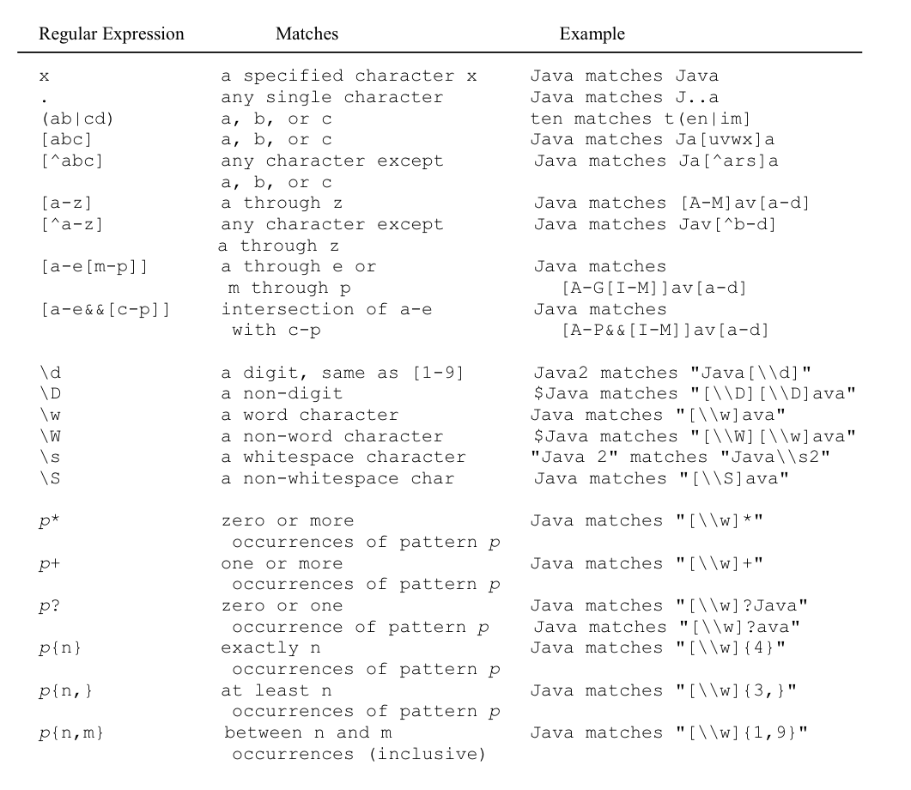

# Strings and Text I/O

## String Class

스트링은 많이 쓰이기 때문에 자바에서 literal 방식으로 만들 수 있도록 했다.

`! String is immutable` 

String의 내용은 변할 수 없다. 아래 예시를 보자

```java
String s = "Java";
s = "HTML";
```


결국 s 라는 새로운 String 클래스가 생성되어 기존에 있던 s 와 연결이 끊기는 것이다. 이후에는 garbage collector 가 공간을 회수해 갈 것이다.

#### interned 

String 은 너무 자주쓰이고 불변하는 특성 때문에 메모리의 효율을 위해서 JVM은 동일한 chracter sequence에 대해서 `unique instance` 을 사용한다. 

이러한 인스턴스들을 `interned`라고 부른다. 


결과를 보면 `s1 == s2 -> false` 이고 `s1 == s3 -> true` 이다. s1 s3 는 동일한 character sequence 를 가지고 있기 때문에 이미 만들어진 s1 으로 연결되기 때문이다.

하지만 명시적으로 `s2 = new Stirng("Welcome to Java");` 처럼 새로운 객체를 만들어준다면 다른 오브젝트로 선언될 수 있다.

## String Comparisons

String 을 비교할 때 `==` 이 아닌 String Method인 `String.equals(targetStr)`을 사용해야 한다.

`==` 는 객체 자체가 동일한지를 판단할 때 쓰인다 위의 예시를 보면 알 수 있다. 만약 위의 예시에서 equals 를 사용한다면 모두 `true`가 나올 것이다.

`str1.compare(str2)`의 경우에는 str1 과 str2를 비교한다. 각 string 마다 length 만큼 돌면서 char 값을 비교하면서 뺀 값을 리턴한다. 

주의할 점은 `"11".compare("101") > 0` 이라는 점이다.

## Substrings

- subString(beginIndex : int)
    - 시작점부터 마지막 까지 string 을 만들어 리턴한다.
- subString(beginIndex , endIndex)
    - 시작점부터 `endIndex-1` 까지 string 을 만들어 리턴한다.

## Converting , Replacing , and Splitting

- toLowerCase()
- toUpperCase()
- trim() : 양쪽의 공백을 없앤다.
- replace(oldChar,newChar)
- replaceFirst
- replaceAll
- split(delimiter)

#### split
- split(String regex)
- split(String regex , int limit)

## Matching
- Matches(String regex) : return true if matched

```java
String s = "a+b$#c".replaceAll("[$+#]", "NNN");
-> aNNNbNNNcNNN
// [$+#] => $ or + or #
```

### regular expression



## Character Class

- isDigit() : return bool
- isLetter() : return bool
- isLetterOrDigit() : return bool
- isLowerCase() : return bool
- isUpperCase() : return bool

## StringBuilder and StringBuffer

- String클래스 대신에 사용되는 클래스이다. 
- String 관련된 곳이라면 어디서나 사용이 가능하다. 그리고 String 보다 더 유연하다
- imuutable 하지 않다는 특징이 있다.

#### java.lang.StringBuilder

- append(data)
- append(data,offset,len)
- delete(start,end)
- deleteCharAt(index , data , offset, len)
- setCharAt(index , ch)
- insert(index , data, offset , len)
- insert(offset , data)
- replace(start , end , str)
- reverse()
