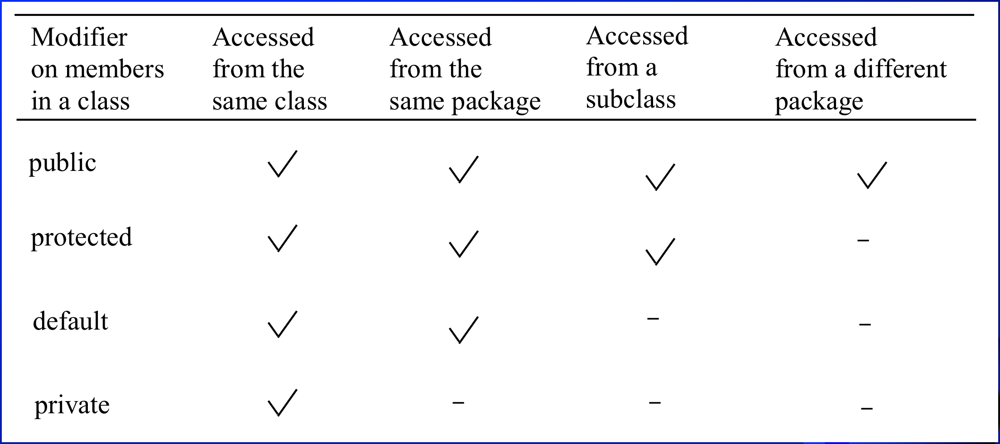

# Inheritance and Polymorphism

사각형 삼각형등 도형에는 공통된 특징들이 있다. 

이러한 도형이라는 공통점을 가진 클래스들은 Inheritance 를 사용해서 구현하는 것이 좋다.

## Inheritance

- SuperClass
    - also parent Class , base Class
- SubClass
    - also child Class , derived Class

superclass 에서 상속받은 클래스를 subclass 라고 한다. 이는 superclass 의 멤버를 사용할 수 있다.

```java
super();
super.methodName();
```

### 상위 클래스는 언제 생성되는가?

Constructor 의 경우는 상속받지 못한다. 상위 클래스는 `super()` 로 생성되고 하위 클래스를 사용할 때 마다 `항상` 생성된다.

- SuperClass 의 Constructor 를 사용하면 Syntax Error 가 발생하니 주의해야 한다.
- super()라는 메서드로 상위 클래스를 default 로 생성하는데 , 만약 상위 클래스에 파라미터가 꼭 필요한 생성자만 있다면 super(parameters) 등으로 직접 생성해야 한다.

상속받은 클래스에서는 항상 상위 클래스가 생성된다. 이로 인해 `Constructor Chaining` 이 발생한다.

`Constructor Chaining` 이란 하위 클래스의 생성을 위해서 상위 클래스가 연속적으로 생성되는것을 말한다. `상위 클래스가 먼저 생성된다는 것만 기억하면 된다.`

### 하위 클래스에서 추가될 수 있는것들

1. new properties
1. new methods
1. `override super methods`
    - 접근할 수 있는 메서드만 override 가 가능하다.
    - superClass 에 있는 `private method` 라면 override가 불가능 하다.
    - 위의 경우 하위 클래스에서 동일한 method를 만든다면 이는 `연관되어있지 않은 method`이다.
    - `static method` 의 경우도 상속받을 수 있다. 또한 override 될 수 있지만 , 그럴 필요가 없을 뿐 더러 override 된 경우 상위 클래스의 `static method`는 사라진다.


### Overriding vs Overloading

이 또한 상속받을 클래스에서 구현할 수 있으며 자세한 내용은 아래를 참고하자

- `Overriding` 이란 재정의 하는 것을 말한다.
    - 이는 동일한 조건을 가진다.
    - 하지만 실행부분이 다르다.
- `Overloading` 이란 함수의 이름은 같으나 조건이 다르다
    - 다른 매개변수가 들어온 경우를 추가로 정의해준다.
    - ex (int i) => (double i) 인 경우 `overloading` 이라고 할 수 있다.


## toString Method

Override가 되지 않은 경우에는 lecture.ch10.A@6979e8cb 처럼 `경로 + 클래스의 이름 + @ + 클래스의 기계적 위치` 가 나온다.

toString 은 사용자의 편의를 위해서 많이 Override 되고는 한다.

## `==` vs `equals`

- `==`
    - two primitive type values 가 동일한지 확인하고
    - 동일한 reference 에서 왔는지 확인한다
    - 즉 같은 객체인지 확인한다.
- `equals`
    - 동일한 contents 를 가졌는지 확인한다.
    - 즉 같은 내용인지 확인한다.

즉 동일한 곳에서 만들어졌는지 까지 확인하기 때문에 , `==` 가 `equals` 보다 더 강력하다. 

## Polymorphism

Polymorphism 이란 다양한 형태를 가질 수 있는 것을 말한다.

즉 다양한 타입의 Object 들을 동일한 Type 의 Object 처럼 다루는 것을 말한다.

## Dynamic Binding

o 라는 Object 가 C1 , C2 , ... , Cn 을 연속해서 상속받는다고 할 때, o.p() 라는 메서드를 호출한 경우

JVM은 p 메소드의 구현 부분을 C1 부터 Cn 까지 차례대로 검색 되고 , 찾는 순간 검색을 멈추고 해당 구현부를 실행시킨다. ( 위로 찾아 올라간다. )

이를 `Dynamic Binding` 이라고 한다.

## Generic programming

Polymorphism 을 사용해서 , Object 자체를 parameter 로 넘기는 경우 조금 더 유연하게 method 들을 사용할 수 있는데 이를 Generic Programming 이라고 한다. 

## Casting and Explicit Casting 

```java
public class Student extends Object{}

Student st1 = new Object(); // error
Object st2 = new Student(); 
Object test = new Object();
Student st3 = test;  // error
Student st4 = (Student)test; // Explicit Casting - OK

```

Object 가 항상 Student 는 아니다. 따라서 st1 의 경우에는 error 가 발생하는 반면에 , st2 같은 경우에 Student 는 항상 Object 이기 때문에 error 가 발생하지 않는다.

st3 의 경우도 마찬가지다. 하지만 만일 test 가 Student 에 해당하는 자격을 갖춘 경우에 (Student) 처럼 Explitcit Casting 을 해줄 수 있다. 

보통 SuperClass 를 SubClass 로 바꿀 때 사용되는데 이는 항상 되는 것은 아니다.

## instanceOf

이러한 캐스팅의 가능성으로 인해서 객체의 원형이 뭔지 모를 수 있다. 

이를 확인하기 위해서 `instanceof Operator` 를 사용해서 boolean 값을 리턴 받을 수 있다.

```java
if( myObject instanceof Circle)
```

## ArrayList and Vector Class

Array 의 특징은 처음에 한번 정해진 크기는 변경되지 않는다는 점이다.

java에서는 저장 제한이 없는 ArrayList 라는 Class 를 제공한다. 

- add(o : Object)
- add( index : int  , o )
- clear() : 모든 원소를 제거한다.
- contains(o) : 리스트에 o 가 있는지 판단한다. ( boolean return )
- get(index)
- indexOf(index)
- isEmpty()
- remove(o)
- remove(index)
- size()
- set(index , o ) 

### ArrayList < - >  Array

```java 
1. ArrayList<> list = new ArrayList<>(Arrays.asList(array));

2. String array[] = new String[ArrayList.size()];
2_2. ArrayList.toArray(array);
```

1번의 경우는 array 가 있는 경우 이를 이용해서 ArrayList 를 만드는 과정이고,

2번의 경우 기존에 ArrayList 가 있는 경우 이를 이용해서 array 를 만드는 과정이다.

### Max and Min in ArrayList

`java.util.Collections`를 사용하는 경우 다양한 메소드들을 사용할 수 있다.
- 쉽게 Max Min 값을 구할 수 있다.
    - `java.util.Collections.min(ArrayList); or max`
- shuffle 또한 가능하다.
    - `java.util.Collections.shuffle(ArrayList);`

## protected Modifier

- 동일한 패키지 내에서 접근이 가능하다.
- 또한 subclasses 에서도 접근이 가능한데 , 이는 동일한 패키지 내에 있을 필요는 없다.

### Modifier 

`private` -> `default` -> `protected` -> `public`



### Final Modifier 

- final class 는 상속 받을 수 없다.
- final variable 는 상수이다 ( 대문자로 표시하는 것이 관례이다. )
- final method 는 override 될 수 없다.


