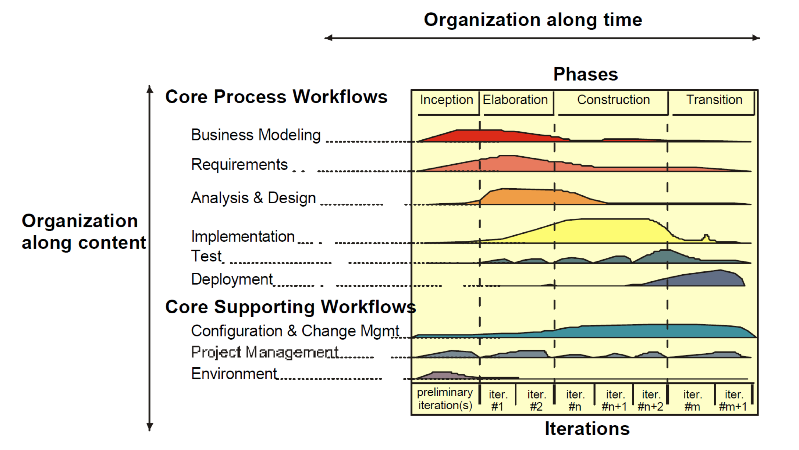
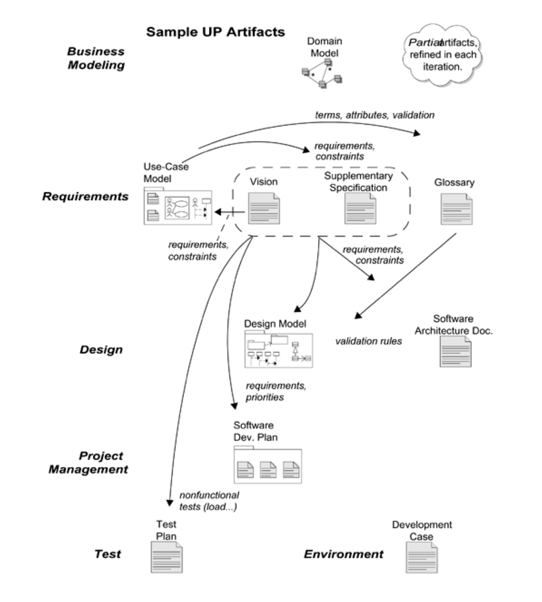

# 모두합쳐놓음

# Software Development Process

## Software Process Model 이란?

### Process Models
- 개발의 혼란을 막기 위해서 누가 어떤것을, 언제 , 어떻게 목표달성 할 것인지 정해놓은 모델들 
- 대표적인 모델은 아래에 있다.
### Typical Process Models
1. `Waterfall Model`
1. `Incremental Model`
1. Evolutionary Models ( `Prototyping` , `Spiral` )
1. Specialized Model ( `Component-Based Development` , `Formal Methods` )
1. `Iterative Model` ( `Agile` )
1. `Unified Process` ( `RUP` )

### 2가지 프로세스 
1. Planed-driven Processes 
    - 사전에 계획된 대로 개발한다.
    - process 는 이 계획을 바탕으로 평가된다. 
1. Agile Processes 
    - 계획은 점진적으로 이루어진다.
    - 고객의 요구사항 변화에 맞춰 프로세스가 변경된다.

### `Waterfall Model`

- 특징
    - `documentation`이 굉장히 `heavy`하다
    - 요구사항이 정해져 있는경우 , 일이 순차적으로 진행된다. 
    - oldest paradigm
- 순서
    1. Communication
    1. Planning
    1. Modeling
    1. Construction 
    1. Deployment 
- 단점 
    - 고객의 요구사항 변화에 맞추기 어렵다
    - `앞의 단계가 끝나지 않으면 다음 단계로 넘어갈 수 없다.`
    - deploy가 늦게 되기 때문에 고객의 feedback 을 기대하기 어렵다
- 언제 쓰이는지?
    - 정확한 요구사항이 정해진 경우에( 변경되지 않는 경우 ) 쓰이면 좋다.
    - 개발이 굉장히 큰 경우에도 쓰인다
    - 항공 , 군사 , 우주 산업 등...

### `Incremental Model `
- Waterfall + Iterative
- 특징
    - 점진적으로 향상된 결과물이 `반복적으로 release` 된다.
    - 전체 프로젝트를 `세분화` 시켜서 개발한다.
    - `each cycle` 마다 고객에게 `feedback` 을 받는다.
    - 고객의 변화를 받아들이는 비용이 줄어든다.
- 단점 
    - `Project 를 management` 하기 힘들다 ( PM이 힘들다. )
    - 모든 버전을 정리하기 어렵다.
    - 결국 `documentation`이 어렵다
    - 구조적으로 엉망이 될 확률이 높다.
- 언제 쓰이는지?
    - small ~ medium size 
    - `parts of` large system

### `Evolutionary Model`
- 2가지 모델이 있다.
    - prototyping , spiral 
#### `Prototyping Model`
- 고객이 요구사항의 디테일을 정해주지 않았을 때 사용한다.
- 혹은 개발자가 알고리즘에 대한 확신이 없거나 특정 OS에 대한 기능이 의심될 때 사용
- 보통 다른 `모델 프로세스 중간`에 사용된다. 

#### `Spiral Model`
- 각 루프가 나선형 구조를 이룬다.
- 고정된 phase가 존재하지 않는다.
- `위험관리`가 핵심이다. (risk analysis)
- 마지막에는 결국 waterfall이라고 할 수 있다.
- 구조
    - Objective setting 
        -  구체적인 목표가 각각의 단계마다 정해진다
    - RiskAssessment and reduction
        - `위험관리`
    - Development and validation
        - 개발할 모델이 정해진다.
    - Planning
        - 프로젝트를 리뷰하고 `다음` 나선형 phase를 준비한다.

### `Specialized Model`
- 2가지 모델 
    - Component-Based Development , Formal Method
#### `ComponentBased Development`
- 쉽게 말해서 오픈 마켓에서 요소들을 구매한 뒤 사용한다.
- 단계 
    1. 가능한 component 들이 평가된다
    1. component들을 합쳤을때 이슈를 생각한다
    1. sw architecture를 거기에 맞춰 변경한다.
    1. architecture에 component들을 병합한다.
    1. testing 
- 하지만 보통 class는 너무 작은 단위라서 기회비용이 맞지 않아 잘 사용하지 않는다.
#### `Formal Method`
- 수학적으로 사용할때 ( 함수들 )
- 보통 검증을 위해서 사용된다.
- 안전이 최우선되는 프로젝트에 사용된다.
    - ex ) 핵관시 시설 , 철도 , 인공위성 등등...

### Iterative Model - `Agile`
- Agile은 빠르게 개발하는 프로세스들의 대표적인 단어
- 특징
    - short iterative cycles(2~3 weeks)
    - 고객의 참여를 필요로한다
    - 팀의 집중도가 요구된다.
- 반드시 포함해야 할것
    1. Iterative `반복`
    1. Incremental `점진성`
    1. Self-organizing `지속적으로 최선책을 찾는다 `
    1. process not determined `변화에 순응한다`
    1. `개개인의 역량`이나 `communication`이 중요

### `Agile (detail)`
- 특징
    - 겨우 작동하는 것을 만들고 점차 변경하자 !
    - 변화가 일어날 수 밖에 없다는 것을 인정하고 순응하자
    - `working software` > `ducumentation` 
    - 계약을 넘어선 고객의 참여가 필요!
- 단점 ( 문제점 )
    - 고객의 지속적인 참여는 쉽지 않다.
    - 팀원들의 집중력이 떨어질 수 있다. ( 지속적으로 유지하기 힘들다. )
    - 이해당사자(`stake holders`)가 많은 경우 우선순위를 정하기 힘들다
    - `refactoring`이 필수 불가결하다.
    - `documentation` 에 약하다. 따라서 계약할 때 힘들다.

### `Rational Unified Model` ( `RUP` )
- 특징
    - Iterative `반복`
    - Architecture centric `구조 중심적`
    - UseCase driven `유즈케이스 기반`
- `Well-defined` and `Well-structured` process

- `Spirits of RUP`
    - Attack  major risk `early` and `continuously`
    - `실행 가능한 sw`를 만드는것에 집중해라
    - `Acommodate change early` (적절한 변화를 빠르게 적용해라)
    - Build System with `component`
- 결국 `RUP` 또한 `Iterative development process`

#### Dynamic Structure of RUP : `4 Phase` 
1. `Inception Phase`
    - `scope`를 정하고 프로젝트의 `lifecycle`을 정한다.
1. `Elaboration Phase`
    - `mitigate risk` and create `stable baseline architecture` 
1. `Construction Phase`
    - `Develop the remainders` ( efficiently )
1. `Transition Phase`
    - `customer acceptance` of the product

#### Dynamic Structure of RUP : `Iterations`
- `resulting in an excutable release`

# Object-Oriented Analysis and Design

## Software development - Solving problems

### purpose of analysis and design 
- requirements -> design of system to-be
- evolve a robust architecture (튼튼한 아키텍쳐를 위해서 )
- 실행 환경에 맞추기 위해서

### `Analysis and Design`
- `Analysis` 
    - focuse on understanding `problems`
    - idealized design
    - `Functional Requirements` 
    - Behavior
    - 문제 자체를 이해하기 위한 과정
    - 기능들에 집중한다.
- `Design`
    - Focus on understanding the `solution`
    - `Performance`
    - Close to `real code`
    - `Non-functional` requirements
    - `A large model`
    - 특정 환경이나 퍼포먼스 등을 고려한다

## `Procedural Programming`
- Program is organized around procedures
- Focusing on `data structure` , `algorithms` , `sequencing of steps`
    - `Program = Algorithm + Data Structure`
- 단점
    - 거대하고 복잡한 것들은 만들기 어렵다.
    - symantic gap
        - analysis + design -> code 로 하기 너무 어렵다
    - 실제 상황이랑 맞춰서 디자인을 하면 굉장히 차이가 많이 난다.
    - Rigid 
        - 뭐 하나를 추가하면 다시 deploy
    - Fragile 
        - if else 등으로 세분화 되어 있다면 찾기가 힘들다
    - Immobile
        - 몇개의 기능이 필요 없더라도 다 가지고 다녀야 한다

## `Object-Oriented Programming` (`OOP`)
- Teminology
    - `Object` : 사람 , 장소 , 물건 (noun)
    - `Method` : `object`에 의한 행동
    - `Class` : 비슷한 Object들의 카테고리
- `Object` 
    - data 와 method 를 둘다 가지고 있다.
    - send and receive messages from actions

## Strength of Object Technology 
- `A single Language` 
    - used by user , analyst , designer 
- `UML` ( Unified Modeling Language )
- code를 작성할 때 앞서 만든 구조(`architecture`)를 활용한다.
- models `reflect real world`
    - easy to understand 
- `stability`
    - 작은 변화가 나타나도 전체적인 흐름에는 영향을 끼치지 않는다.
- `adaptive to change`
    - 변화 수긍적

# ch1 : Object-Oriented Analysis and Design

## Analysis and Design
- `Analysis` 
    - Investigation : what is `problem` and what `requirements`
    - `requirements analysis` or `Object Orientede Analysis`(OOA)
    - Discover `domain concept`
    - 메소드가 나오면 안된다 그냥 개념만 있다.

- `Design`
    - `Conceptual solution` to fullfill requirements
    - `Object Oriented Design`(OOD) or `database design`
    - `sw Object`(현실에는 없을수도 있다) 를 정의한다. 

## UML 이란 무엇인가?

- UML ( Unified Model Language )
- 구조와 요소들을 보여주는 언어라고 생각하자 

### `Three Ways` to apply UML
1. UML as `Sketch`
    - 스케치 용도 , 사실상 정보의 누락이 상관없다. 이해만 하면 된다.
    - informal and incomplete `diagrams`
1. UML as `Blueprint`
    - 스케치보다는 정확하다 . 잘못된 정보가 있어서는 안된다. 
    - detailed design diagrams
    - 2 가지에 사용된다. 
        1. reverse engineering
        1. code generation
        - 코드를 역으로 이해시키거나 코드를 만들거나 할때
1. UML as `programming language`
    - Template 같은 느낌이다.
    - 프로그래머가 코드를 만지지 않는다. 완성된 코드이다.
    - `complete executable specification` of software

### `Three Perspective` to Apply UML
1. Conceptual perspective
    - `diagrams` are interpreted as `describing things` in real world or `domain` of interest
1. Specification (software) perspective
    - `diagrams` describes `software abstractions` or `components`
    - but 특정 환경에 대한 언급은 없다 ( C , java )
1. Implementation (software) perspective
    - `diagrams` describe software implementations in a particular tech
    - 특정한 환경에서의 실행 결과를 보여준다.
- 1 번에서 3 번으로 갈수록 구체적이다.

### UML 은 결국
- `OOAD` 가 아니다!
    - 체계적으로 개발하는 방식이 아니다.
- UML 은 객체 지향적 사고를 가르치지 않는다.
- MDA 로서 사용하지 않는다면 , 완벽한 솔루션이 아니다.

# ch2 : Iterative , Evolutionary , and Agile

### UP ( Unified Process )
- 객체지향 시스템을 만드는 인기있는 소프트웨어 개발 프로세스
    - 반복적이고
    - 유연하다
    - 어떻게 OOAD 를 해야하는지 예시를 제공한다.

## What If We don't Care about UP
- 이 책에서 전체적으로 UP 를 예제로 생각하고 있다.
1. 객체를 어떻게 생각해야 하는지
1. UML 적용
1. 디자인 패턴
1. Agile 모델링
1. 진화적인 요구 분석
1. 유즈케이스 작성

### Iterative , Evolutionary Development
- `Iterative development` 
    - 고정된 기간의 반복들로 이루어져 있다. (fixed length iterations)
        - Time boxing 이라고 한다.
    - 각각의 반복에서 각자의 `requirement analysis , design , implementation , itegration` 이 다 들어가 있다. 
    - 시스템이 점점 커지는 특징을 가지고 있으며 , `timebox가 끝나면 결과가 나와야 한다`.
    - 자동화 툴이나 테스팅 툴이 필요하다.
    - `Build - Feedback - Adapt`
        - 만들고 피드백받고 적응해라
    - 만들면 만들수록 올바른 방향으로 가기 위해서 지속적으로 판단해야 한다.
    - `초기에 심각한 오류들을 잡는 것`이 중요하다

- Iterative 를 적용하는것은 이로울까?
    - 프로젝트를 실패할 확률이 낮고, 더 좋은 품질과 낮은 결함률을 보인다.
    - 특히 `리스크 관리를 초반`에 하기 때문에 더욱 결함이 낮다.
    - 일찍 보여줄수 있고 피드백을 받을 수 있다.
    - `analysis paralysis`에 걸리지 않는다. ( 분석을 과도하게 하는경우 )
    - 반복할수록 품질 향상에 기회가 생긴다.
- Iteration은 짧아야 하고 , 고정되어야 한다.

### Risk-Driven and Client-Driven Iterative Planning 
- UP는 risk-driven과 client-driven 을 합친것을 좋아한다.
    - 보여주는것을 중시하고, 심각한 오류를 줄이기 위해서

### Agile Methods?
- timebox와 evolutionary development를 적용
- 순응적인 플랜을 가진다.
- 점진적인 결과물을 독려하고, 민첩할 수 있도록 한다

### Agile Modeling ?
- 다른 모델링을 피하는것이 아니다.
- `모델링의 주 목적은 이해와 대화를 돕기 위함`이다.
- sotfware design에 사용되는 `모든 것을 디자인하는것이 아니다`.
- 최대한 좋은 표현을 사용해라
- 모든 모델은 정확하지 않고 `마지막 코드와 디자인은 급격하게 변할 수 있다는 것`을 알아라
- 개발자들은 `객체 지향 디자인 모델링`을 해야한다.

### Iterative and Evolutionary Analysis and Design

### UP practices ( UP 예제 )
- 핵심 개념은 
    1. short timebox iterative
    1. evolutionary
    1. adaptive development
- 추가적으로
    - `초반에 빠르게 핵심 가치와 높은 리스크`를 잡아야 한다.
    - `초반에 중심 구조`를 잡아야 한다.
    - `고객을 계속해서 참여`하도록 유도해야 한다.
    - 적절한 곳에 `Use Case` 를 사용해라
    - UML과 같은 시각적인 모델링을 해야한다.
    - 요구 사항 변경을 다룰줄 알아야 한다.
- UP phase
    1. `Inception`
        - 비전이나 범위 , 비용등을 고려해보고 판단한다.
    1. `Elaboration`
        - 중앙 구조나 높은 위험도를 가진것을 생각해보고 , 비전을 다시 생각한다. 대부분의 요구사항이 여기에서 잡히고 평가된다.
    1. `Construction` 
        - 낮은 위험도 요소들 나머지들을 잡고 개발 준비에 들어간다.
    1. `Transition` 
        - 테스트와 개발 출시를 한다.

- UP 용어
    - artifact 
        - 결과물들을 지칭한다
        - 코드 , 데이터베이스 , 텍스트 , 다이어그램 등등...
    - Discipline
        - 어떤 구역에서의 결과물의 집합을 의미한다.
        - 예를들어서 요구사항 분석 단계에서의 활동들

  # ch4 : Inception is Not the Requirements Phase 
##### inception step에 대해서 알아본다.

## what is Inception?
- Inception Phase 에서 고려하는 것
    - 될만한 프로젝트인가?
    - 비전이 있고 비지니스 사례가 있는가?
    - 사야하는가 만들어야 하는가?
    - 더 진행해야 하는가 멈춰야 하는가
- 한마디로
    - `Envision the product scope, vision, and business case`

### How much UML
- Inception에서 UML diagram 은 사실상 필요가 없음 
    - 왜냐하면 중요한 점은 많은양의 정보를 얻는것
    - 프로젝트가 가치가 있는지 멈춰야 하는지 등등...
    - 약 10% 정도만 알면 된다 그리고 text forms로 작성된다.
    - `UML은 Elaboration`에서 쓰인다

# ch5 : Evolutionary Requirements
##### FURPS+ , UP requirements artifacts

## Defiition : Requirements
- Requirements
    - 요구사항은 수행되어야 할 능력과 상황을 말한다.
    - requirement analysis에서는 클라이언트와 팀에게 정확하게 정보를 전달하는 것이 중요하다.

- Finding Requirements skillfully?
    - 고객과 useCase 를 만들것
    - 고객과 개발자를 포함한 워크샵을 요구할것
    - 데모를 고객에게 보여주고 피드백을 요청할것

## Types and Categories of Requirements
- UP에서는 요구사항이 FURPS+ 모델을 통해서 나눠질 수 있다.
    - Functional
        - 안정성 , 보안 등...
    - Usability
        - 사람에 관련된 것들 , 도규먼트
    - Reliability
        - 예측가능성 , 회복가능성
    - Performance
        - 응답시간 , 정확도 , 소스 사용량
    - Supportability
        - 유지력 , 적응력
    - \+ ! 
        - 부속물들 예를들어 인터페이스나 법 등등...
## Quality Attributes / Requirements
- Non-Functional Requirements 를 말한다.
- `URPS`
- `Quaility Attributes`는 `functional requirements 보다` 구조에 많은 영향을 끼친다.
- 중요한 점은 functional requirements 가 완벽하더라도 `non-functional requirements 가 좋지 않으면 쓸모가 없다`.

## UP artifacts 에서 어떻게 요구사항이 구성되는가?

- UseCase Model
- Supplymentary Specification
- Glossary
- Vision
- Business Rules

# ch6 : Use Cases

## Use Cases
- `text story`
- 어떤 actor가 goal을 성취하기 위한 스토리를 글로 표현한 것이다.
- diagram이 아니다!

### Definition : Actors , Scenarios and Use Cases
- Actor
    - 사람뿐만 아니라 어떤 행동을 하는 모든것을 지칭한다.
- Scenarios 
    - actor와 system간의 연속된 행동들과 반응들을 말한다.
    - 또한 `UseCase Instance` 라고도 한다.
- Use Case
    - Actor가 목적을 이루기 위해 시스템을 사용하면서 관련된 성공 시나리오 그리고 실패 시나리오 들의 집합이다.

## Use Case and Use Case Model
- UseCase Modeling 이 더 큰개념
    - Use-Case Modeling 과정 안에 Use-Case Model이 들어가 있다.

## UseCase 를 사용하는 이유
- `유저의 목표`를 확인하기 쉽다
- `유저의 관점과 목표`를 강조한다.
- UseCase는 스케일을 유동적으로 조절할 수 있다.

## UseCase는 functional requirements ?
- YES
    - functional requirements이다.
    - FURPS 중에서 `F`를 담당한다.
    - 다른곳에서도 사용 가능하다.

## Three Kinds of Actors
1. Primary Actor
    - 서비스에 의해서 수행되는 목표를 가지고 있는 존재
1. Supporting Actor
    - 페이먼트 시스템
1. Offstage Actor
    - usecase에 관심이 있으면서 둘다 아닌 존재
    - 세금 같은 것들...

## Sections Meaning 
- Level
    - User-Goal level
    - Subfunctional level
- Stakeholders and Interest lists 
    - 시스템이 해야 하는 것에 대한 제시를 해준다.
- Preconditions , Success Guarantees (PostConditions)
    - 시나리오가 시작되기 전 되야하는 것들
    - 시나리오가 끝났을 때의 결과들 
- Main Success Scenario
    - happy path
- Extensions ( Alternate Flows)
    - happy path에서의 가지로 뻗친 상황들
    - `Main Success Scenario + Extionsions` 로 stakeholder를 만족시켜야 한다.

## How to Find UseCases
1. `system boundary` 를 정한다
1. `primary actor` 를 정한다
1. 각 primary actor 의 `goal` 을 정한다
1. `UseCase`를 정한다.

- actor 와 goal 은?
    1. usecase diagram을 사용
    1. actor - goal list -> usecase diagram

## Who is Primary Actor
- 중요하다 핵심!
    - `Boundary` 를 신경써야 한다.
    - `primary actor` 는 `boundary 바깥`에 있다.

- useful level usecase 를 정하는 테스트 3가지
    1. the boss test
    1. EBP test(Elementary Business Process)
        - 한사람이 어떤 기간동안 할수 있는 양을 생각한다.
    1. Size test

## Using UML : Use Case Diagrams
- UseCase Diagram 은 다음을 설명해준다
    - name of usecase
    - actors
    - relationship
- Activies Diagram 도 있다.
    - text가 더 많으며 그림과 같이 설명해놨다.

# ch7 : Other Requirements

## Other Requirements Artifacts
- Supplementary Specification
    - URPS+
    - constrains, standards
- Glossary
    - terms , definitions : data dictionary
- Vision
    - vision : executive summary
- Business Rules
    - tax , transcend one particular application

## Supplymentary Specification
- URPS+
- information , constrain
- 굳이 Inception phase 에서만 정할 필요가 없다
    - evolutionary Method 임을 기억하자
- 하지만 빠르게 잡을수록 좋다.
- 왜냐하면 architecture 에 많은 영향을 미치기 때문에

## Vision
- stakeholders를 위한 한번 더 요약된 정보들
- Key High-Level Goals and Problems
- Summary of System features
- usecase 의 이름들을 그대로 나열하면 , stakeholder가 이해하기 힘들 수 있기 때문에

## Feature
- 시스템이 할 수 있는 행동들이다. ( Features are behavioral functions)
- The System does <Feature> 로 확인한다.
- 시스템은 feature를 한다.

# ch8 : iteration 1 Basics

## Iteration 1 Requirements and Emphasis
- 요구사항의 일부만 처리한다. 
- 동일한 요구사항은 반복될 수록 좋아지게 만든다

## Inception 에서는 뭐가 이뤄지는가?
- 워크샵
- 이름들이 정해진다
- 대부분의 UseCase 가 러프하게 만들어진다. (`그중에 10% 만 제대로`)
- 영향을 많이 끼치고 치명적인 결함들을 찾아낸다.
- architecture들의 후보들이 생긴다.

## Elaboration (Phase 2)
- the core , risky software architecture is programmed
- 코어 아키텍쳐를 만든다
- 하이리스크 엘리먼트들을 처리
- 대부분의 요구사항이 정해짐
- 전체적인 스케쥴과 자원들이 판단된다.
- `Domain Model` 과 `Design Model` 그리고 `Data Model` 이 시작된다.

## UseCase Ranking
- 초반에 감을 잡기 위해서 순위를 메긴다
- 기준
    1. Risk
    1. Coverage
    1. Criticality

# ch9 : Domain Models
- 도메인의 중요한 개념들을 보여준다.
- 

## Domain Model 이란?
- conceptual classes 와 실제 오브젝트들을 보여준다
- `visual dictionary` 라고도 불린다.
- `SW objects 는 들어갈 수 없다`.
- 실제 상황에서 일어나는 것들을 말한다.

### conceptual classes 란?
- 3가지로 이루어져 있다.
    1. Symbol : 단어나 이미지
    1. Intension : class 설명
    1. Extension : 적용되는 클래스들의 집합

- 만드는 이유는?
    1. elaboration iteration 동안 그들의 개념과 관계를 정확하게 알기 위해서
    1. design model에서 domain layer에 있는 `sw classes에 영감을 주기 위해서`
- 도메인 모델은 Object-Oriented 모델과 갭이 적다.
-  
- 도메인 모델을 SW 개발에 참고하는데 특히 네이밍에 영향을 많이 준다.
- 이해를 증진

## How to Create Domain Model
- 중요
    1. conceptual classes 를 찾는다.
    1. 위의 클래스들을 통해서 UML diagram을 그린다
    1. Association 과 attributes를 추가한다.
- conceptual classes를 찾는 전략
    1. 이미 확인된( 자주 일어나는 패턴들 ) 모델들을 찾아서 사용한다.
    1. category list
    1. noun phrases

## Attributes VS Classes 
- 현실세계에서 텍스트나 번호로 표현되지 않으면 class 라고 생각한다.
- Description Class도 있다

## Associations
- 클래스들의 관계 , 의미있는 연결을 말한다.
- 언제 쓰는가? => 기억 할만한 정보가 있을 때 쓴다.
- 많은 관계들은 피해야 한다
    - visual noise 라고 한다.
- domain modeling 에서는 쓰이지 않는다.
- `navigation` , `visibility` 특징을 가지고 있다.
- 도큐먼트나 자료구조에 쓰이지 않음

## Apply UML : Association Notation
- 클래스 사이의 선으로 표현
- Capital letter 로 시작한다.
- association name ( + reading direction )
    - 종속 관계 표시
- Multiplicity
    - 몇개의 관계가 맺어지는지 표시
- 이름은 classname-verb-classname 를 기반으로 한다.
- 애매한 특성을 가진 이름들은 쓰지 않는다.

### Role
- 
- 각 Association의 끝을 Role 이라고 한다
- 이러한 특성을 가질 수 있다.
    - multiplicity expression
    - name
    - navigavility 

### Attributes
- 객체의 논리적인 데이터 값
- 우리가 기억해야 할 것들이다.

## UML 에서의 Attributes 
visibility name : type multiplicity = default {property-string}
- ( + - ) 는 public private ( 기본 - )
- static value 를 표현하기 위해서 \ 를 사용한다 ( Derived Attributes )

# UML Class Diagram

- Individuals of System
- Notation
    - Class Name : Class
    - attribute = current value
    - Anonymous Object

## Object Diagram
- `instance diagram` 이라고도 한다.
- 특정한 순간의 스탭샷이다

## from Object to Class
- Object는 class의 인스턴스 이다.
- Object는 다음 세가지를 가지고 있다
    1. Class name
    1. Attributes 
    1. Operations
- Instance variable(= Instance attribute)
    - 인스턴스에 할당된 특성을 가르키는 말  
- class variable (= class attribute , static attribute)
    - 한번만 정의되고 모든 인스턴스가 공유한다.
- class operation (= static opertion)   
    - 인스턴스가 없는 경우에 사용 가능

## Abstract Operations and Classes
- Abstract Operation 은 바디가 없다 
- Abstract class 는 인스턴스화 할수 없다. 
- concrete 는 반대다
- 추상 메소드가 있으면 무조건 추상 클래스
- 추상 메소드가 없어도 추상 클래스 일수도 있다.
- 이태리체로 표현 or <<>> or {abstract}

## Interface
- 
- Provided interfaces , Required interfaces

  

