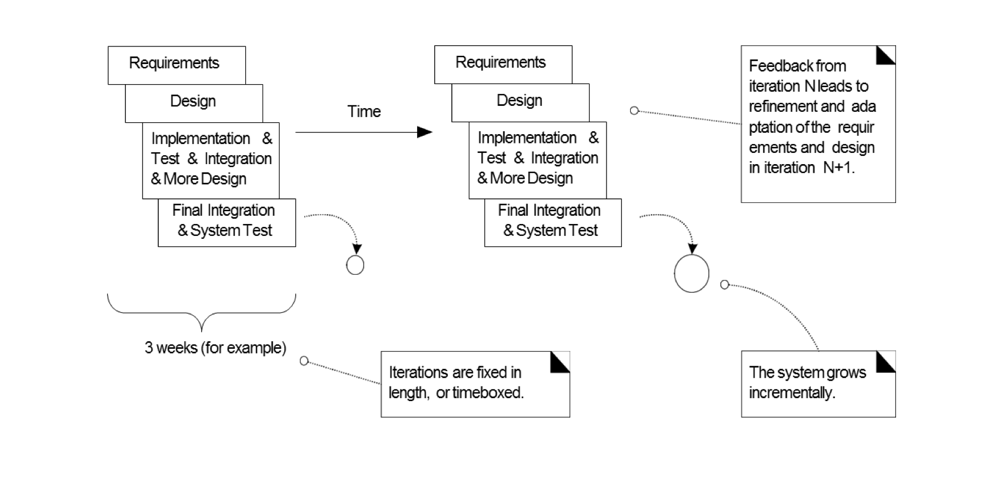

# ch2 : Iterative , Evolutionary , and Agile

### UP ( Unified Process )
- 객체지향 시스템을 만드는 인기있는 소프트웨어 개발 프로세스
    - 반복적이고
    - 유연하다
    - 어떻게 OOAD 를 해야하는지 예시를 제공한다.

## What If We don't Care about UP
- 이 책에서 전체적으로 UP 를 예제로 생각하고 있다.
1. 객체를 어떻게 생각해야 하는지
1. UML 적용
1. 디자인 패턴
1. Agile 모델링
1. 진화적인 요구 분석
1. 유즈케이스 작성

### Iterative , Evolutionary Development
- `Iterative development` 
    - 고정된 기간의 반복들로 이루어져 있다. (fixed length iterations)
        - Time boxing 이라고 한다.
    - 각각의 반복에서 각자의 `requirement analysis , design , implementation , itegration` 이 다 들어가 있다. 
    - 시스템이 점점 커지는 특징을 가지고 있으며 , `timebox가 끝나면 결과가 나와야 한다`.
    - 자동화 툴이나 테스팅 툴이 필요하다.
    - `Build - Feedback - Adapt`
        - 만들고 피드백받고 적응해라
    - 만들면 만들수록 올바른 방향으로 가기 위해서 지속적으로 판단해야 한다.
    - `초기에 심각한 오류들을 잡는 것`이 중요하다

- Iterative 를 적용하는것은 이로울까?
    - 프로젝트를 실패할 확률이 낮고, 더 좋은 품질과 낮은 결함률을 보인다.
    - 특히 `리스크 관리를 초반`에 하기 때문에 더욱 결함이 낮다.
    - 일찍 보여줄수 있고 피드백을 받을 수 있다.
    - `analysis paralysis`에 걸리지 않는다. ( 분석을 과도하게 하는경우 )
    - 반복할수록 품질 향상에 기회가 생긴다.
- Iteration은 짧아야 하고 , 고정되어야 한다.

### Risk-Driven and Client-Driven Iterative Planning 
- UP는 risk-driven과 client-driven 을 합친것을 좋아한다.
    - 보여주는것을 중시하고, 심각한 오류를 줄이기 위해서

### Agile Methods?
- timebox와 evolutionary development를 적용
- 순응적인 플랜을 가진다.
- 점진적인 결과물을 독려하고, 민첩할 수 있도록 한다

### Agile Modeling ?
- 다른 모델링을 피하는것이 아니다.
- `모델링의 주 목적은 이해와 대화를 돕기 위함`이다.
- sotfware design에 사용되는 `모든 것을 디자인하는것이 아니다`.
- 최대한 좋은 표현을 사용해라
- 모든 모델은 정확하지 않고 `마지막 코드와 디자인은 급격하게 변할 수 있다는 것`을 알아라
- 개발자들은 `객체 지향 디자인 모델링`을 해야한다.

### Iterative and Evolutionary Analysis and Design

### UP practices ( UP 예제 )
- 핵심 개념은 
    1. short timebox iterative
    1. evolutionary
    1. adaptive development
- 추가적으로
    - `초반에 빠르게 핵심 가치와 높은 리스크`를 잡아야 한다.
    - `초반에 중심 구조`를 잡아야 한다.
    - `고객을 계속해서 참여`하도록 유도해야 한다.
    - 적절한 곳에 `Use Case` 를 사용해라
    - UML과 같은 시각적인 모델링을 해야한다.
    - 요구 사항 변경을 다룰줄 알아야 한다.
- UP phase
    1. `Inception`
        - 비전이나 범위 , 비용등을 고려해보고 판단한다.
    1. `Elaboration`
        - 중앙 구조나 높은 위험도를 가진것을 생각해보고 , 비전을 다시 생각한다. 대부분의 요구사항이 여기에서 잡히고 평가된다.
    1. `Construction` 
        - 낮은 위험도 요소들 나머지들을 잡고 개발 준비에 들어간다.
    1. `Transition` 
        - 테스트와 개발 출시를 한다.

- UP 용어
    - artifact 
        - 결과물들을 지칭한다
        - 코드 , 데이터베이스 , 텍스트 , 다이어그램 등등...
    - Discipline
        - 어떤 구역에서의 결과물의 집합을 의미한다.
        - 예를들어서 요구사항 분석 단계에서의 활동들

    
