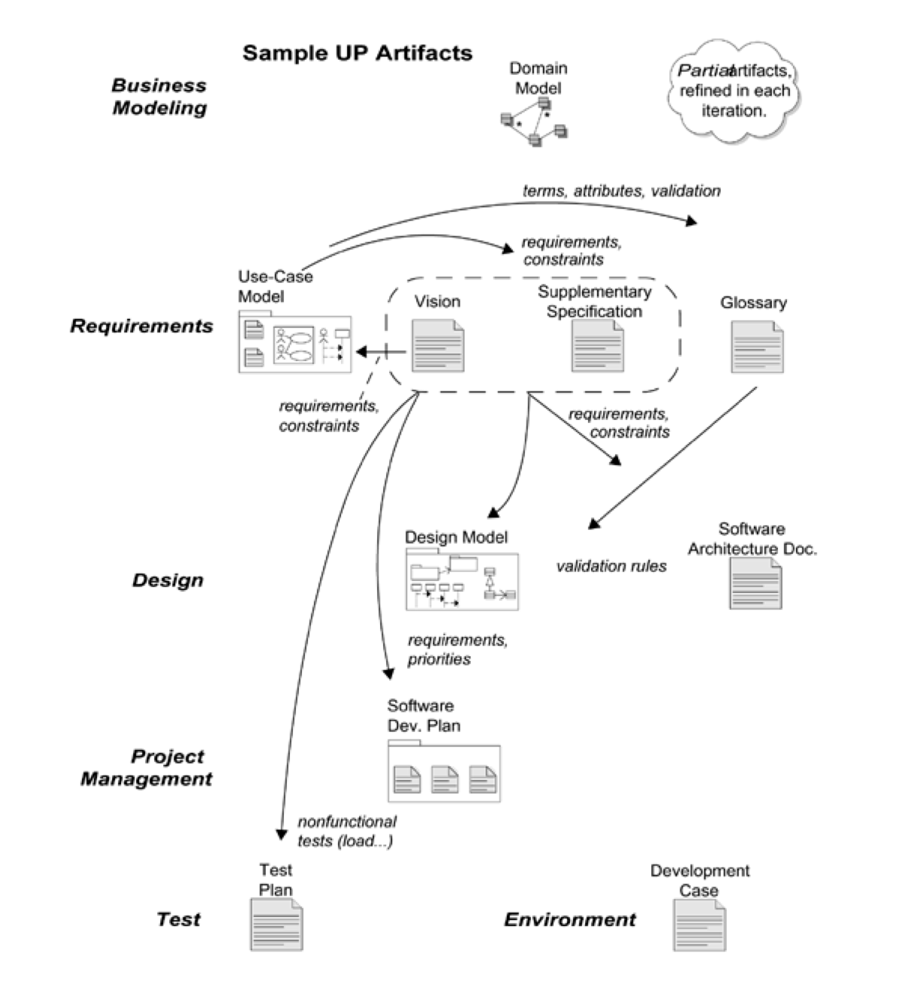

# ch7 : Other Requirements

## Other Requirements Artifacts
- Supplementary Specification
    - URPS+
    - constrains, standards
- Glossary
    - terms , definitions : data dictionary
- Vision
    - vision : executive summary
- Business Rules
    - tax , transcend one particular application

## Supplymentary Specification
- URPS+
- information , constrain
- 굳이 Inception phase 에서만 정할 필요가 없다
    - evolutionary Method 임을 기억하자
- 하지만 빠르게 잡을수록 좋다.
- 왜냐하면 architecture 에 많은 영향을 미치기 때문에

## Vision
- stakeholders를 위한 한번 더 요약된 정보들
- Key High-Level Goals and Problems
- Summary of System features
- usecase 의 이름들을 그대로 나열하면 , stakeholder가 이해하기 힘들 수 있기 때문에

## Feature
- 시스템이 할 수 있는 행동들이다. ( Features are behavioral functions)
- The System does <Feature> 로 확인한다.
- 시스템은 feature를 한다.
