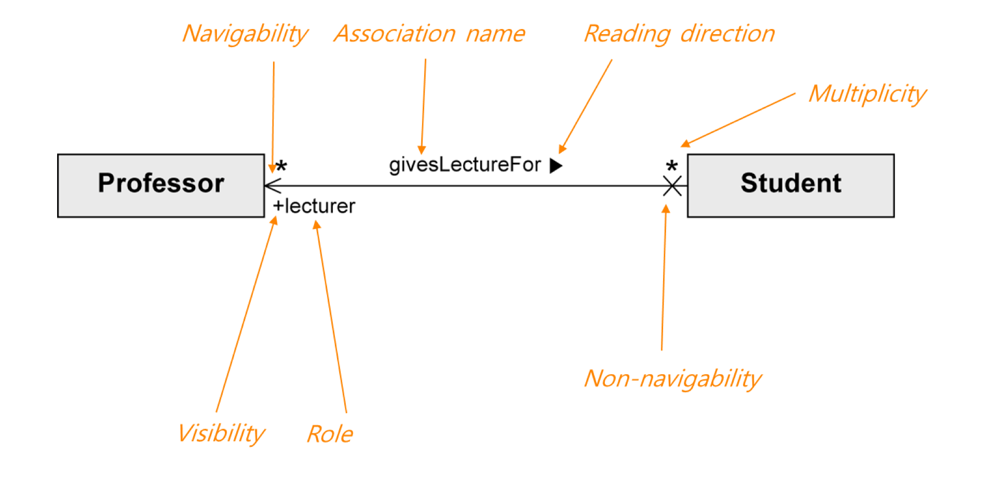

# ch8 : iteration 1 Basics

## Iteration 1 Requirements and Emphasis
- 요구사항의 일부만 처리한다. 
- 동일한 요구사항은 반복될 수록 좋아지게 만든다

## Inception 에서는 뭐가 이뤄지는가?
- 워크샵
- 이름들이 정해진다
- 대부분의 UseCase 가 러프하게 만들어진다. (`그중에 10% 만 제대로`)
- 영향을 많이 끼치고 치명적인 결함들을 찾아낸다.
- architecture들의 후보들이 생긴다.

## Elaboration (Phase 2)
- the core , risky software architecture is programmed
- 코어 아키텍쳐를 만든다
- 하이리스크 엘리먼트들을 처리
- 대부분의 요구사항이 정해짐
- 전체적인 스케쥴과 자원들이 판단된다.
- `Domain Model` 과 `Design Model` 그리고 `Data Model` 이 시작된다.

## UseCase Ranking
- 초반에 감을 잡기 위해서 순위를 메긴다
- 기준
    1. Risk
    1. Coverage
    1. Criticality

# ch9 : Domain Models
- 도메인의 중요한 개념들을 보여준다.
- 

## Domain Model 이란?
- conceptual classes 와 실제 오브젝트들을 보여준다
- `visual dictionary` 라고도 불린다.
- `SW objects 는 들어갈 수 없다`.
- 실제 상황에서 일어나는 것들을 말한다.

### conceptual classes 란?
- 3가지로 이루어져 있다.
    1. Symbol : 단어나 이미지
    1. Intension : class 설명
    1. Extension : 적용되는 클래스들의 집합

- 만드는 이유는?
    1. elaboration iteration 동안 그들의 개념과 관계를 정확하게 알기 위해서
    1. design model에서 domain layer에 있는 `sw classes에 영감을 주기 위해서`
- 도메인 모델은 Object-Oriented 모델과 갭이 적다.
-  
- 도메인 모델을 SW 개발에 참고하는데 특히 네이밍에 영향을 많이 준다.
- 이해를 증진

## How to Create Domain Model
- 중요
    1. conceptual classes 를 찾는다.
    1. 위의 클래스들을 통해서 UML diagram을 그린다
    1. Association 과 attributes를 추가한다.
- conceptual classes를 찾는 전략
    1. 이미 확인된( 자주 일어나는 패턴들 ) 모델들을 찾아서 사용한다.
    1. category list
    1. noun phrases

## Attributes VS Classes 
- 현실세계에서 텍스트나 번호로 표현되지 않으면 class 라고 생각한다.
- Description Class도 있다

## Associations
- 클래스들의 관계 , 의미있는 연결을 말한다.
- 언제 쓰는가? => 기억 할만한 정보가 있을 때 쓴다.
- 많은 관계들은 피해야 한다
    - visual noise 라고 한다.
- domain modeling 에서는 쓰이지 않는다.
- `navigation` , `visibility` 특징을 가지고 있다.
- 도큐먼트나 자료구조에 쓰이지 않음

## Apply UML : Association Notation
- 클래스 사이의 선으로 표현
- Capital letter 로 시작한다.
- association name ( + reading direction )
    - 종속 관계 표시
- Multiplicity
    - 몇개의 관계가 맺어지는지 표시
- 이름은 classname-verb-classname 를 기반으로 한다.
- 애매한 특성을 가진 이름들은 쓰지 않는다.

### Role
- 
- 각 Association의 끝을 Role 이라고 한다
- 이러한 특성을 가질 수 있다.
    - multiplicity expression
    - name
    - navigavility 

### Attributes
- 객체의 논리적인 데이터 값
- 우리가 기억해야 할 것들이다.

## UML 에서의 Attributes 
visibility name : type multiplicity = default {property-string}
- ( + - ) 는 public private ( 기본 - )
- static value 를 표현하기 위해서 \ 를 사용한다 ( Derived Attributes )
